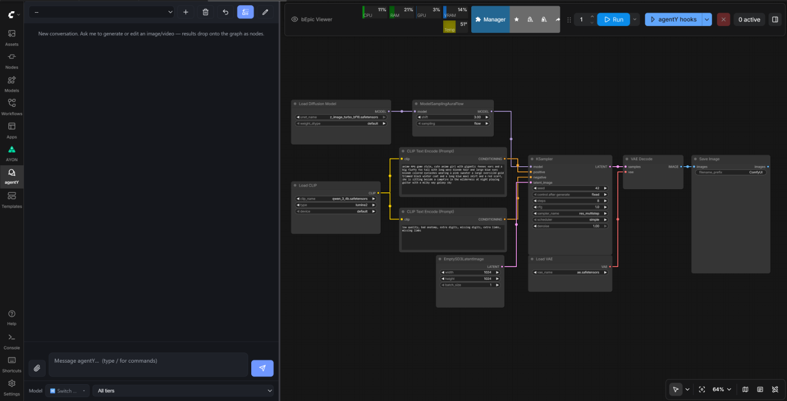

# agentY

An AI agent that builds and runs [ComfyUI](https://github.com/comfyanonymous/ComfyUI) workflows from plain language. You chat with it in a **sidebar tab inside ComfyUI**; whatever it makes lands on your graph as a loader node, ready to wire into the next thing.

> 📖 **New here?** The [**Using agentY guide**](docs/using-agentY.md) is a screenshot-driven tour of everything below.



---

## Features

- **Text → workflow → result** — describe it; the agent picks a template, builds the graph, runs it and puts the output on your canvas.
- **Learns workflows from the web** — for something it doesn't know yet, it searches the web and builds the workflow from what it finds.
- **Works with every LLM** — Claude, GPT, Gemini, Qwen (DashScope) or local Ollama models, mixed per role.
- **Image & video** — Flux, WAN, Qwen, HunyuanVideo and more: generate, edit, inpaint, upscale.
- **Hook nodes** — put instructions on the canvas ("sweep the seed 6×"), chain them into pipelines, bake a chain into plain ComfyUI subgraphs.
- **Inspect-and-improve loops** — the agent judges each output against your condition, changes one thing and runs again, within a budget you set.
- **Output QA** — a briefing per run or per stage; ratio, resolution, sharpness and likeness are measured, the rest is judged, misses are re-generated.
- **Review stops** — pause a chain, pick the outputs that continue; your picks train a ranking score.
- **Parallel agents** — several conversations at once, or one agent per shot of a sequence.
- **Agent spawning** — it starts sub-agents and specialists (vision, video, coder, web search) when a job calls for one.
- **Tagging system** — name a reference once (`#hero_face`) and use it in any prompt or hook.
- **Memory** — long-term memory across sessions, per-project notes, and chat history that survives restarts.
- **Slack support** — follow and drive the same conversation from a DM (optional, off by default).
- **MCP, both ways** — uses tools from external MCP servers (Magnific, Blender, …) and ships its own MCP server for Claude Desktop ([agentY-mcp](https://github.com/szprivate/agentY-mcp)).
- **Sees your canvas** — reads and edits the open graph, takes screenshots of it, fetches web reference images onto it.
- **Model management** — finds, checks and downloads the model files a workflow needs from Hugging Face.
- **Your own templates and skills** — register any workflow as a template; save a procedure as a skill.
- **Settings in ComfyUI** — keys, model choices, MCP servers and token cost per model, all in one panel.

---

## Requirements

- **Windows**, or **macOS 14+ on Apple Silicon** (on a Mac run `xcode-select --install` first)
- **[uv](https://docs.astral.sh/uv/getting-started/installation/)** and **git** on your PATH
- A running **ComfyUI** (default: `http://127.0.0.1:8188`)
- At least one LLM: an **Anthropic**, **OpenAI**, **Google Gemini** or **DashScope** API key, or a local **Ollama**
- A **Hugging Face token** (for gated-model downloads)

---

## Installation

### 1. Clone the repository

```bash
git clone https://github.com/szprivate/agentY.git
cd agentY
```

### 2. Run the installer (recommended)

```powershell
.\install_agent.ps1     # Windows
```
```bash
./install_agent.sh      # macOS
```

Same eight stages either way, and a test keeps them in step by comparing the two
scripts' stages, flags and prompts. The installer sets up the **whole stack** in
one pass:

1. checks for `git` + `uv`;
2. **updates agentY itself** to the remote's newest commit, then clones the sibling repos it needs — **agenty_core** (required) and **agentY-mcp** (optional) — next to `agentY` if they aren't there already, and fast-forwards them if they are;
3. creates agentY's `.venv` (via `uv`, on Python 3.12), sorts out **torch** — on Windows it offers the CUDA build when it sees an NVIDIA GPU, because the wheel on PyPI is CPU-only and that makes SAM3 grounding take about a minute a call; on a Mac the PyPI wheel already carries Metal, so it just reports whether MPS was found — and installs `requirements.txt` (which pulls in `agenty_core` editable);
4. copies `.env_example` → `.env` and **prompts** you for `HF_TOKEN`, `ANTHROPIC_API_KEY`, and the optional `COMFYUI_API_KEY` / `DASHSCOPE_API_KEY` (Enter keeps an existing value);
5. asks which **memory embedder** long-term memory should use (a built-in local one, Ollama, or a provider you have a key for);
6. **finds your ComfyUI** (auto-detects common paths, otherwise asks) and clones **agentY-comfyuiConnect** into its `custom_nodes/`, optionally pointing `settings.local.json` at your ComfyUI URL;
7. sets up **agentY-mcp**'s own venv + `.env` and reuses the tokens you just entered;
8. **checks the result** — every dependency agentY names is import-tested in the venv that will run it, and anything missing is listed with what it costs.

**Updating an existing install** is the same command: run the installer again.
It brings all the checkouts — agentY, agenty_core, the sidebar extension — to the
remote's newest commit first, and when that update replaced the installer itself,
the new one takes over. Files the agent rewrites in its own checkouts
(`config/models.json`, saved templates) do not block it: the ones the update also
changes are parked in a `git stash`, never discarded. A checkout it could **not**
update is reported in red as `NOT updated`, with the reason — it is never called
up to date. On Windows the agent has to be stopped while its environment changes
(Windows cannot replace a file a running process has open); the installer finds a
running one and offers to stop it. An install older than this behaviour needs one
`git pull` in the `agentY` folder first, so that it has this installer.

Useful flags:

```powershell
.\install_agent.ps1 -ComfyUIPath "D:\ai\ComfyUI"   # skip ComfyUI auto-detection
.\install_agent.ps1 -SkipMcp                        # don't set up agentY-mcp
.\install_agent.ps1 -SkipComfyNode                  # headless host only, no ComfyUI node
.\install_agent.ps1 -NonInteractive                 # no prompts (CI / re-runs)
.\install_agent.ps1 -SkipTorch                      # don't offer the CUDA torch build
.\install_agent.ps1 -TorchIndexUrl "https://download.pytorch.org/whl/cu126"
.\install_agent.ps1 -PythonVersion 3.13             # the Python a NEW .venv is made with (default 3.12)
.\install_agent.ps1 -Help
```
```bash
./install_agent.sh --comfyui-path ~/ComfyUI
./install_agent.sh --skip-mcp
./install_agent.sh --skip-comfy-node
./install_agent.sh --non-interactive
./install_agent.sh --help
```

There is no `--skip-torch` on macOS, and nothing is missing: the PyPI wheel is
already the right build there, so there is no second one to decline.

That last step is also a standalone command, worth running whenever a feature is
mysteriously doing nothing: most of these packages are somebody else's dependency
too, so a gap only shows up on the machine that resolved differently.

```powershell
.venv\Scripts\python.exe scripts\check_env.py        # full report
.venv\Scripts\python.exe scripts\check_env.py --gpu  # + is torch actually on CUDA?
```
```bash
.venv/bin/python scripts/check_env.py --gpu           # macOS: reports MPS
```

The launcher keeps the environment in line on every start
(`scripts/sync_deps.py`): it installs `requirements.txt` again when a required
package is missing, or when the dependency files changed since this `.venv` was
last installed — including after a `git pull` you ran yourself. When nothing is
missing and nothing changed, it says nothing.

<details>
<summary><b>Manual setup</b> (instead of the installer)</summary>

```powershell
# agenty_core must sit next to agentY (requirements.txt installs it editable)
git clone https://github.com/szprivate/agenty_core.git ..\agenty_core

# agentY itself. --python names the interpreter on purpose: with a conda env
# active (miniconda auto-activates `base`), uv installs into that one instead.
uv venv .venv
uv pip install --python .venv\Scripts\python.exe torch torchvision `
    --index-url https://download.pytorch.org/whl/cu128     # NVIDIA GPUs; skip on CPU
uv pip install --python .venv\Scripts\python.exe -r requirements.txt
.venv\Scripts\python.exe scripts\check_env.py              # confirm it all imports
copy .env_example .env

# the ComfyUI sidebar + canvas nodes (restart ComfyUI afterwards)
git clone https://github.com/szprivate/agentY-comfyuiConnect  <ComfyUI>\custom_nodes\agentY-comfyuiConnect

# (optional) the MCP / Claude Desktop front end
git clone https://github.com/szprivate/agentY-mcp.git ..\agentY-mcp
```
</details>

### 3. Configure secrets

The installer prompts for these; to edit them later, open `.env` **or** use the in-panel Settings (see below):

```dotenv
HF_TOKEN=hf_...                 # Hugging Face token (for gated model downloads)
ANTHROPIC_API_KEY=sk-ant-...    # for Claude
DASHSCOPE_API_KEY=...           # Alibaba Model Studio (DashScope) — for Qwen models
OPENAI_API_KEY=sk-...           # for OpenAI (GPT) models
GEMINI_API_KEY=...              # for Google Gemini models (GOOGLE_API_KEY also works)
COMFYUI_API_KEY=comfyui-...     # only if your ComfyUI requires auth / uses API nodes

# Optional
# AGENTY_UI_HOST=127.0.0.1
# AGENTY_UI_PORT=5000        # 5001 on macOS; unset = whatever config/ says
# AGENTY_CONVERSATION_DB=./memory/conversations.sqlite
# AGENTY_PYTHON_NODE_DISABLED=1   # make the agentY python node a no-op (see Canvas nodes)
```

### 4. The ComfyUI sidebar + canvas nodes

The installer clones [`agentY-comfyuiConnect`](https://github.com/szprivate/agentY-comfyuiConnect)
into ComfyUI's `custom_nodes/` for you. If you skipped that step (or ComfyUI
wasn't found), install it by hand and restart ComfyUI once:

```powershell
git clone https://github.com/szprivate/agentY-comfyuiConnect  <ComfyUI>\custom_nodes\agentY-comfyuiConnect
```

After the restart you get, from the one node pack:
- the **agentY** tab in ComfyUI's left sidebar (the chat panel);
- the **agentY** node category with **`agentY hook`**, **`agentY qa`** and **`agentY python`** (see [the hook system](docs/using-agentY.md#the-hook-system));
- an **Open agentY Settings…** entry in ComfyUI's Settings panel — the one door to
  everything else (auth keys, model tiers, MCP servers, pricing, and the log /
  memory / token-usage viewers).

Keeping it current is automatic: every launcher start fast-forwards agentY,
`agenty_core` **and** this extension (see [Staying up to date](docs/using-agentY.md#staying-up-to-date)).

---

## Usage

Start the agent:

```powershell
.\run_agent.ps1        # Windows
```
```bash
./run_agent.sh         # macOS
```

Then open **ComfyUI**, click the **agentY** tab in the left sidebar, and chat:

- *"Generate a cinematic wide shot of Tokyo at night."*
- *"Edit this photo to make it daytime."* (attach an image with 📎)
- *"Make 5 variations of a red sports car, different angles."*
- *"Upscale the last image with UltimateSD."*

Type `/` for the slash commands. Settings live in ComfyUI's **Settings → agentY → Open agentY Settings…**. Every start also updates agentY; `-Help` / `--help` lists the launcher's options.

---

## Documentation

- [**Using agentY**](docs/using-agentY.md) — the full guide: chat, hooks, QA, settings, MCP, memory, models, troubleshooting.
- [**Slack**](docs/slack.md) — setting up the Slack bridge.
- [**Reference**](docs/reference.md) — architecture, ports, security, what the agent may run, model tiers, macOS notes.

---

## License

MIT
