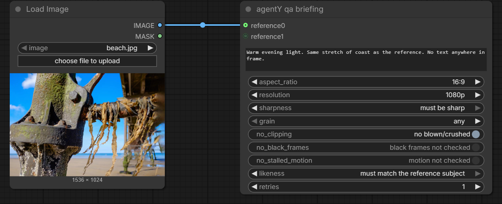

# Using agentY

A practical guide to driving **agentY** — the AI agent that builds and runs
[ComfyUI](https://github.com/comfyanonymous/ComfyUI) workflows from natural
language, right inside ComfyUI's sidebar. For install/setup see the
[README](../README.md); this guide is about *using* it once it's running.


*The agentY tab lives in ComfyUI's left sidebar. You chat on the left; every
result the agent produces is dropped onto the graph on the right as a loader
node, ready to wire into your next step.*

---

## Contents

- [The big picture](#the-big-picture)
- [Starting a session](#starting-a-session)
- [Staying up to date](#staying-up-to-date)
- [On a Mac](#on-a-mac)
- [The chat panel](#the-chat-panel)
  - [Talking to a turn that is already running](#talking-to-a-turn-that-is-already-running)
- [Generating & editing](#generating--editing)
  - [Finding reference images on the web](#finding-reference-images-on-the-web)
  - [Marking up an image](#marking-up-an-image)
  - [Asking about a video](#asking-about-a-video)
  - [Seeing the plan first](#seeing-the-plan-first)
  - [Long jobs: batches and background work](#long-jobs-batches-and-background-work)
- [Slash commands](#slash-commands)
- [**The hook system**](#the-hook-system)  ← the most powerful part
  - [Tagging a reference](#tagging-a-reference-the-agenty-add-tag-node)
  - [Asking the agent to change a setting](#asking-the-agent-to-change-a-setting)
  - [Letting the agent edit the whole graph](#letting-the-agent-read-and-edit-the-whole-graph)
  - [Filling a slot nothing is wired to](#filling-a-slot-nothing-is-wired-to)
  - [Loops: keep trying until it's right](#loops-keep-trying-until-its-right)
  - [Screenshots of your workflow](#screenshots-of-your-workflow)
  - [Dry run: check the logic first](#dry-run-check-the-logic-before-you-pay-for-it)
  - [Review: stop and pick what continues](#review-stop-and-pick-what-continues)
  - [The keep switch](#the-keep-switch-should-this-outlive-the-run)
  - [Memorize: produce once](#memorize-produce-once-reuse-until-something-changes)
  - [Naming what a hook produces](#naming-what-a-hook-produces)
- [Slack: a second way in](#slack-a-second-way-in)
- [Checking outputs (QA)](#checking-outputs-qa)
  - [Ticking the boxes instead of writing them](#the-agenty-qa-node)
  - [Does it match the reference?](#does-it-match-the-reference)
  - [Which of these is best?](#which-of-these-is-best)
  - [One briefing per stage](#one-briefing-per-stage)
  - [It fixes the shape rather than re-rolling](#it-fixes-the-shape-rather-than-re-rolling)
- [The agentY python node & collectors](#the-agenty-python-node--collectors)
- [Settings & secrets](#settings--secrets)
- [MCP servers](#mcp-servers)
- [Token usage & cost](#token-usage--cost)
- [Memory](#memory)
- [Choosing models](#choosing-models)
- [Custom workflow templates](#custom-workflow-templates)
- [Building a node for a new model](#building-a-node-for-a-new-model)
- [Troubleshooting](#troubleshooting)

---

## The big picture

You describe what you want; agentY researches a template, assembles a ComfyUI
workflow, submits it, waits, checks the result against your
[QA briefing](#checking-outputs-qa) if you set one, and stages the output back
onto your graph.

Two ways to drive it:

1. **Chat** — type in the sidebar (*"generate a cinematic wide shot of Tokyo at
   night"*).
2. **Canvas hooks** — annotate the graph with **`agentY hook`** nodes and ask
   the agent to run it. This is where agentY becomes a graph-native automation
   tool rather than just a chat box — see [The hook system](#the-hook-system).

Everything is local: chat history lives in a SQLite file, and results are staged
into ComfyUI's `input` dir and dropped onto the graph as nodes.

---

## Starting a session

1. **Start the agent host** (the SSE backend the sidebar talks to, on
   `http://127.0.0.1:5000` — `:5001` on macOS, where AirPlay Receiver holds
   5000; the sidebar is told which, so you do not have to match it by hand):

   ```powershell
   .\run_agent.ps1     # Windows
   ```
   ```bash
   ./run_agent.sh      # macOS
   ```

   Restarting the launcher is how you pick up agent-side code/config changes.
   If the host isn't running, the chat panel shows a **▶ Start server** button —
   which opens a PowerShell window on Windows and a Terminal window on a Mac.

   On start it also **checks for updates** and fast-forwards agentY, `agenty_core`
   and the ComfyUI sidebar extension — see [Staying up to date](#staying-up-to-date).

2. **Open ComfyUI** in your browser (default `http://127.0.0.1:8188`) and click
   the **agentY** tab in the left sidebar.

3. Start typing. Type `/` for the slash-command menu; use the thread dropdown to
   revisit past conversations.

> If the backend runs on a non-default URL, set it once in the browser console:
> `localStorage.agentY_backend = "http://host:port"`.

### On a Mac

Everything above the launcher is the same code, so the panel, the hooks, the QA
briefings and the canvas nodes behave identically. Four things differ, and they
are all at the edges:

**The launcher and installer are shell scripts.** `./install_agent.sh` and
`./run_agent.sh`, with the same stages and the same switches as their PowerShell
counterparts — spelled `--port` rather than `-Port`. If `./run_agent.sh` says
*permission denied*, `chmod +x run_agent.sh` (the installer does this for you).

**The GPU is Metal, not CUDA.** SAM3 grounding — what locates the thing you asked
to circle — runs on MPS, and `check_env.py --gpu` tells you whether torch found
it. Nothing needs installing for that: the ordinary PyPI wheel carries Metal, so
there is no macOS equivalent of the CUDA-index step Windows needs. If it reports
no MPS, reinstall torch rather than hunting for a special build; there isn't one.

**▶ Start server opens Terminal** instead of a PowerShell window, and runs the
script there so you can read what it says. That is the point of a visible window:
when the host refuses to start — a port in use, a broken `.env` — the reason is
printed, and a background process would swallow it.

**The collector nodes' file dialog may come from AppleScript.** They use Tk when
ComfyUI's Python has it; Homebrew's python omits it unless `python-tk` was
installed too, and in that case the node falls back to the system dialog. Same
picker, nothing to install, and multi-select works either way.

Two things to know before you start: the install needs **Xcode Command Line
Tools** (`xcode-select --install`), because `insightface` and `sam3` publish no
macOS wheel and are compiled during setup; and **Apple Silicon on macOS 14+** is
the tested target — on an Intel Mac, `onnxruntime` and `faiss-cpu` ship arm64-only
wheels at current versions, so face-likeness QA would need older pins.

---

## Staying up to date

Each start checks the remotes and fast-forwards the three checkouts that make up
agentY: this repo, `agenty_core`, and the sidebar extension (both the clone
ComfyUI loads and a dev clone beside agentY, if you have one).

It is deliberately timid, because it runs unattended over your working copy:

- a repo with **uncommitted changes** is left completely alone — never stashed,
  never discarded;
- a repo with **unpushed commits** is left alone — never rebased, never reset;
- it is **`--ff-only`**, so a diverged branch reports and stops rather than merging;
- being **offline** is a shrug, not a failed start.

Anything it declines to do it says out loud, so a stale checkout is never silent:

```
[update] agentY is 3 commit(s) behind origin/main - fast-forwarding...
[update] agentY updated -> 1895057
[update] agenty_core has uncommitted changes - skipping (nothing was touched).
[update] agentY-comfyuiConnect is up to date.
```

If the pull touched `requirements.txt`, dependencies are reinstalled before the
app starts. If it touched the extension, you're told to restart ComfyUI (or just
reload the browser, for JS-only changes).

Turn it off with `auto_update = false` (Settings ▸ advanced ▸ Behaviour),
`-NoUpdate` / `--no-update`, or `AGENTY_NO_UPDATE=1`. If your ComfyUI isn't in an
obvious spot next to agentY, point `comfyui_dir` at it so the extension is found.

> The launcher updates *itself* too, but the copy already running is the old
> one — changes to it apply from the next start.

---

## The chat panel


**Top bar (left → right):**

| Control | What it does |
|---|---|
| **Thread dropdown** | Switch between saved conversations. |
| **➕ New chat** | Start a fresh thread. |
| **🗑 Delete** | Delete the current conversation. |
| **📊 Token usage** | Open the [cost breakdown](#token-usage--cost). |
| **🖼 Auto-graph** | Toggle **autograph** on/off — whether finished workflows/results are loaded onto the canvas automatically. Highlighted when on. Takes effect immediately (no restart). |

**Composer:**

- **📎 Attach** — add an image to your message (for edits, references, etc.).
- **Message box** — your prompt. `/` opens the command menu.
- **➤ Send**.
- **Model** — a live **Switch model…** picker for the orchestrator (only vendors
  whose API key is set appear), and an **agent scope** selector (*All agents* or
  a specific role) so a model switch can target one stage. This is the in-panel
  equivalent of [`/switch_model`](#slash-commands).

### Talking to a turn that is already running

Anything you type while the agent is working becomes a **⏳ chip** above the
composer and is sent when the turn ends. You don't have to wait for it, though:

| On the chip | What happens |
|---|---|
| **↳** | Hands the message to the **running** turn. The agent reads it at its next step and carries on from where it is — it doesn't start over. |
| **Shift + ↳** | Same, but **cancels the step it was about to take** so it reads you first. Nothing already produced is undone. |
| **✕** | Drop it. |

Two things worth knowing. The agent picks the message up **between tool calls**,
so if it is in the middle of a long one — a batch of eleven generations, a
specialist doing research — your words land when that finishes. To stop something
already running, use **⏹ Stop**, which also interrupts ComfyUI. And if the turn
happens to end before the message reaches the agent, nothing is lost: it goes
back on the queue and is sent with the next turn, and the panel says so.

Messages with an attached image stay queue-only — a mid-run message reaches the
agent as text.

---

## Generating & editing

Just describe the outcome:

- *"Generate a cinematic wide shot of Tokyo at night."*
- *"Edit this photo to make it daytime."* (attach an image with 📎)
- *"Make 5 variations of a red sports car, different angles."*
- *"Upscale the last image with UltimateSD."*

Each finished image or video appears as a **loader node on your graph** (staged
into ComfyUI's `input` dir), immediately wireable into your next workflow. The
chat carries the agent's *text*; the media lands on the canvas. Toggle **🖼
autograph** off if you'd rather it not place nodes automatically.

### Finding reference images on the web

References arrive on the canvas the same way generated images do:

> *"Search the web for images of this car — from every angle, and the interior."*

The agent searches, picks, downloads into ComfyUI's `input` directory, and drops
every picture it keeps onto your graph as a loader node. **Downloading is
showing** — there is no extra step to ask for. Name a number ("five options") and
it stages that many; otherwise it takes the best one or two, because a reference
that will feed a generation wants the *right* picture rather than a pile.

It skips watermarked stock previews where it can, and does not place a file that
turns out not to be an image (a hotlink block, a login page served at
`…/photo.jpg`) — a loader pointing at an HTML page shows nothing and fails when
the graph runs.

### Marking up an image

> *"Circle the bolts."*  *"Put a red box around the logo."*  *"Show me where the
> damage is."*

The marks are drawn **on top of** your picture — your photograph with ink on it,
not a re-generated lookalike, so nothing else in the frame moves. You choose the
shape (circle, box, arrow), the colour, and whether marks are numbered or
labelled; the result lands on the canvas like any other output.

Locating what you named is the only part that needs a model. Everything after —
de-duplicating overlapping hits, scaling, drawing — is fixed, so the same request
twice gives the same marks.

### Asking about a video

Attach a clip and ask about it. Frames are sampled across its length and read by a
video-understanding agent (same **Vision** tier as the one that reads your
images), so *"what happens in this shot"*, *"when does the camera start moving"*
and *"is the logo visible at the end"* are answerable without scrubbing.

For cutting rather than reading, ask for the shots: agentY finds the cuts and
writes one file per shot, which is what the
[collectors](#the-agenty-python-node--collectors) hand back to a workflow.

### Seeing the plan first

Anything taking more than one step — a graph with several hooks, a chain of
stages, a multi-part request — is announced first: the agent writes a short
numbered plan into the chat, then gets on with it. You are not asked to confirm,
because you can read it while it works and interrupt with **↳** (see [talking to a
running turn](#talking-to-a-turn-that-is-already-running)).

If you'd rather it **wait**, say so anywhere the agent reads:

- in your message: *"Show me the plan and wait for my go before you run anything"*
- in a hook directive, where it becomes a standing rule for that graph:
  *"Ask me first before you start generating"*
- in the project's memory, where it applies to every thread on that project

Then nothing runs until you answer: the tools that generate, queue or execute
refuse for that turn and the panel says **✋ holding**. Your next message releases
it — a *yes* runs the plan as stated, a change is applied first. One round trip,
not one per step; the next new request asks again. Override a standing rule for a
single turn with *"go ahead"* or *"just do it"*.

### Long jobs: batches and background work

*"Run every image in this folder through that workflow."* A run over many inputs
does not block the conversation: it is scheduled as a **batch job** and a detached
worker drives ComfyUI on its own. Ask how it is going and the agent reports
progress; ask it to stop and it stops.

Stages chain. With two workflows, each input goes through the first, its output
feeds the second, and you get one final file per input — the usual shape for
*"upscale everything, then add grain"*.

Some things finish long after the turn that started them, such as an async
provider render. Those arrive on their own: downloaded, dropped onto the canvas as
a loader node, and a notification tells you it landed whether or not you were
looking at the panel.

---

## Slash commands

Type `/` in the composer for an autocomplete menu.

| Command | Action |
|---|---|
| `/restart` | Restart the agent pipeline |
| `/stop` | Stop and shut down the agent |
| `/unload` | Unload Ollama models from VRAM |
| `/clear_vram` | Clear ComfyUI GPU VRAM |
| `/images` | List images generated in this thread |
| `/project_memory` | Inspect and forget what is remembered for **this project** (characters, style, named references) |
| `/clearhistory` | Delete all conversation history |
| `/switch_model <target> <provider,model>` | Set a model **tier**, a single role, or `all` (e.g. `/switch_model fast_utility dashscope,qwen3.6-flash`). Saved to `settings.local.json` |
| `/add_workflow <path>` \| `/add_workflow canvas <name>` | Register a workflow template (a JSON file, or the open graph) |
| `/remove_workflow <name>` | Remove a registered template |
| `/resend` | Resend the first user message |

---

## The hook system

Hooks are **instructions you attach to the graph itself**. Drop an **`agentY
hook`** node (category **agentY**), wire it, type a directive, and ask the agent to
run the graph. On a normal **Queue Prompt** a hook is *inert* — an identity
passthrough nothing downstream needs — so it means something only when the
**agentY agent** runs the graph.

### Anatomy of a hook


*Two `agentY hook` nodes wired output → anchor form a two-stage pipeline:
"generate a scene" feeds "animate it".*

- **`anchor` input (auto-grows).** Wire any node's output in as **context /
  input**. Each time you wire one, a fresh empty anchor slot appears, so a single
  hook can gather several inputs. Type-agnostic (image, video, or a scalar).
- **`out` output.** The value(s) the hook produces, which you wire into a real
  node's input (or into the next hook). Also type-agnostic.
- **`directive`** — the natural-language instruction / prompt.
- **`purpose`** — what the hook *is* (below).
- **`remember`** — should what this hook produced outlive the run? (see
  [the keep switch](#the-keep-switch-should-this-outlive-the-run)). It reads
  *bake into subgraph* on `make_workflow` and *memorize result* everywhere else,
  because that is what keeping each of them means.

To **disable one without deleting it**, bypass (`Ctrl+B`) or mute (`Ctrl+M`) it
like any other node — no separate toggle to remember, and a disabled hook is
obvious on the canvas.

> **Mental model:** a hook is an **upstream producer**. It reads its anchors as
> context and produces the value(s) for its output, which you wire into the input
> it should fill. The agent fills the input the output is wired to — it does not
> guess "the connected node" from prose.

### What the agent can *see* on an anchor

Wire a **Load Image / Load Video** node (or an [agentY
collector](#the-agenty-python-node--collectors)) into an anchor and the agent sees
the picture straight away: the node names a file, so there is something to look at
before anything runs.

Wire **anything else** — a `VAEDecode`, an upscaler, an `ImageBlend`, a mask op —
and there is no file anywhere; that wire carries a **tensor that only exists during
a run**. agentY *taps* it before the turn starts: it trims your graph to that
node's ancestors, renders it, and hands the agent the file. You'll see
`🔎 Rendering hook input(s)…` while it happens.

- Only the **upstream** part runs. Your savers and unrelated branches are not in
  the tap graph, so nothing lands in your output folder and your pipeline is not
  kicked off. (A tapped `VIDEO` wire is the exception — ComfyUI has no
  preview-video node, so those go to `output/agentY_tap/`.)
- If the graph has **already run**, ComfyUI serves it from cache and the tap is
  near-instant. On a cold graph it really does render that branch first.
- `IMAGE`, `MASK`, `LATENT` (decoded with the graph's own VAE) and `VIDEO` are
  supported; a batch contributes its first few frames.
- Turn it off with **`hook_tap_tensors`** in Settings → Behaviour (or
  `AGENTY_HOOK_TAP=0`). Tuning: `AGENTY_MAX_HOOK_TAPS` (4 wires per turn),
  `AGENTY_HOOK_TAP_FRAMES` (4), `AGENTY_HOOK_TAP_TIMEOUT` (300s).

### Tagging a reference (the `agentY add tag` node)

Wire five images into one hook and every one of them is "an image". The **`agentY
add tag`** node fixes that. It sits *on a wire* — `Load Image → add tag →
anywhere` — and carries two optional fields doing different jobs:

- **`tag name`** — a short handle: `hero_face`, `alley_light`;
- **the prompt box** — what the agent should *take* from it: *"the face only — not
  the hair, not the wardrobe"*, *"the light, not the architecture"*. The agent
  describes the image with your question instead of describing it whole, and
  carries the restriction into the prompt it writes. That is how a reference for
  the *lighting* stops dictating the architecture.

The tag **names** it. Once one tag exists anywhere on the canvas, typing `#` in any
hook's prompt box opens a menu of every tag in the scene — keep typing to filter,
`↑`/`↓` to move, `Enter` or `Tab` to insert, `Esc` to dismiss:

```
Put #hero_face in the alley, lit like #alley_light. Wide shot.
```

Each `#name` points at exactly one node. The agent gets the mapping with the graph
(`#hero_face → node 43 (LoadImage)`), so it resolves the name instead of guessing
which of five wired inputs you meant. A `#name` no tag carries is flagged in the
[dry run](#dry-run-check-the-logic-before-you-pay-for-it) rather than quietly
matched to the nearest input.

**A named reference is an input — you can skip the anchor wire.** Naming a tag in a
hook's prompt hands that hook the reference, exactly as wiring it would: the hook
block reports it under `NAMED IN THE DIRECTIVE`, the run keeps that node (and
whatever produces it) in scope, and a `make_workflow` hook that names one builds an
image-to-image job rather than treating the prompt as text-to-image. Five
references and three hooks need five wires, not fifteen.

**Making a tag outlive the graph.** Turn on **`remember for the project`** and the
reference goes into [project memory](#memory) as a named entry — the file's path
and what you said it is for. `#hero_face` then resolves in a *new* graph too, and a
Claude Desktop session on the same ComfyUI can read it. There it resolves to a
**file**, not a node: the agent uploads and wires it rather than anchoring it.

Turning the switch off stops refreshing that entry but does **not** delete it — a
graph that happens not to contain the tag must never silently forget it. Forgetting
is yours: `/project_memory` (or **agentY settings ▸ Viewers ▸ 📌 Project memory**)
lists everything remembered for this project and lets you delete it. It doesn't let
you write, so each file has only one source.

Two things still want the wire:

- **A reference that has to reach a node in your own graph.** A name cannot make
  ComfyUI carry a value between nodes — only a wire does. So the image a sampler
  branch consumes, or the `LoadImage` an `iterate` hook swaps each turn, stays wired.
- **A mid-graph tensor** (a `VAEDecode`, an upscaler, a mask op) carries no file of
  its own, and only a *wired* anchor is rendered to disk for the agent to look at.
  Tag a saved image, or wire the tensor into the hook.

Because the node lives on the wire there is no node id to keep in sync: whatever is
plugged into it is what it is about, and rewiring it moves the tag. Anchoring a
hook on the tag node itself is fine — the agent reports the `LoadImage` behind it,
not the annotation.

> Spaces and a leading `#` are forgiven (`#hero face` and `hero_face` are the same
> tag), so the name you see in the menu is always the one that resolves.

### Asking the agent to change a setting

You can just say it: *"turn QA off"*, *"stop putting workflows on my canvas"*,
*"don't retry failed QA outputs"*, *"let yourself see the whole graph"*. The agent
changes it, tells you what it was before, and says when it takes effect (usually
your next message; `auto_update` at the next server start).

It can only touch a **short, fixed list** — behavioural switches and a few small
numbers:

`canvas_full_graph` · `autoload_workflows_into_canvas` · `hook_scoped_graph` ·
`hook_tap_tensors` · `comfyui_console_lines` · `auto_update` · `memory.enabled` ·
`qa.enabled` · `qa.max_retries` · `qa.max_outputs` · `qa.max_references` ·
`qa.video_frames` · `llm.history_window`

Everything else — model choices, folders, server URLs, API key variables — stays
yours, in the Settings dialog. Not because the agent couldn't write them, but
because a misread sentence that flips `qa.enabled` costs a QA pass, while one that
rewrites `output_dir` or `comfyui_url` costs your work or points the app at the
wrong machine. Ask for one of those and it names the setting instead.

Changes go to `config/settings.local.json`, never the committed defaults, so they
survive updates and undoing one by hand is deleting a line.

### Letting the agent read and edit the whole graph

By default the agent sees only the nodes you have **selected**, and can change only
those. Selecting is how you say *"this one"* — but it also means every edit starts
with clicking the node.

Turn on **`canvas_full_graph`** (Settings ▸ Behaviour, or
`AGENTY_CANVAS_FULL_GRAPH=1`) and it sees the whole open workflow — every node's
id, type, your title and its values — and can change any of them with nothing
selected. *"Set the sampler to 30 steps"*, *"what does this graph actually do?"*,
*"find the node writing to the wrong folder"* all work directly, and a selection
still narrows it to what you mean.

It is **off by default because it costs tokens on every canvas turn**, whether or
not the turn was about the graph: roughly 250 for a 20-node workflow, ~1.5k for
200, capped past that. Worth turning on if you edit graphs by chatting.

Listed values are shortened to one line per node, and the agent is told to re-read
a truncated one in full before rewriting it, so a long prompt is never
half-rewritten. Editing never queues the graph — you run it, except for a loop you
asked for, below.

### Screenshots of your workflow

Ask for a picture of the graph and you get one:

> *"send me a screenshot of my workflow on Slack"*


It is your canvas as **you** have it — your node positions, groups, colours,
whatever you collapsed — not a re-drawing from the JSON. Cropped to the graph, with
ComfyUI's render-stats overlay left out. Your view doesn't move: the zoom is put
back before the browser paints a frame.

Three things worth knowing:

- **Big graphs come back as an overview.** ComfyUI stops drawing node text below a
  certain zoom, so a workflow too large to fit on one readable page arrives showing
  shape and wiring with no labels. The agent says so rather than pretending
  otherwise; select the part you mean and ask again to get it at full size.
- **Prompts are in it, but drawn in.** ComfyUI keeps multiline text in HTML boxes
  floating *above* the canvas, invisible to a canvas drawing, so agentY paints each
  back in at the real box's position and size. Wrapping matches — but a prompt
  clipped where the real one scrolls is why.
- **It needs the browser open.** The page draws the picture, so a closed tab means
  no picture, and the agent tells you rather than waiting.

If several workflows are open in ComfyUI's tabs, the agent is told which ones and
which is active. It only ever reads, edits, runs or photographs the **active** tab
— the others are saved state, not live graphs — and it will ask rather than switch
your tab for you.

### Filling a slot nothing is wired to

An unwired input is invisible: it does not exist in the graph until something is
plugged in. So a model node with ten free reference slots and nothing in them
looks, to anything reading the workflow, like a node with no reference slots at
all — which is a problem, because that is the shape of a very ordinary request:

> *"Run those two again, but with the photo I just gave you as a reference."*

The agent can fill a slot **nothing is wired to**: it reads what the node really
has from ComfyUI's schema, adds a loader for your file, and connects it — for that
run only. Your canvas is untouched, so there is nothing to undo and nothing left
behind.

- **Only for some of the runs, if you like.** An empty value leaves the slot
  unwired for that one, so *"use the reference on three of the four"* works.
- **It never fakes it.** Naming a file in the prompt text is not wiring a
  reference — the model never receives the picture and the run reports success
  anyway. If a reference cannot be wired you are told why, rather than handed a
  render that quietly ignored it.

### Loops: keep trying until it's right

A workflow that works, and you want the agent to *keep going* until the output
meets a condition. No hook nodes, no template — your own graph as it stands:

> *"Ok let's try a loop — you change the prompt until the woman's position in the
> output matches her position in the original frame."*

The agent runs your graph, judges what came out against your condition, rewrites
the prompt and runs again — you watch the value change in your own node — and stops
the moment it is met.

What makes it work:

- **A condition you can see in the picture.** It becomes the criteria each output
  is graded on — by the same judge as [QA](#checking-outputs-qa), so the same rules
  apply. *"She stands where she does in the reference"* is judgeable; *"make it
  better"* will just churn.
- **The reference is usually already there.** "The original frame" is the image
  your graph loads, and that is what it compares against unless you name another.
- **One value changes.** By default the prompt — it will not pick a *negative*
  prompt on its own, and it never touches your checkpoint, sampler or seed. Say
  which node to vary if your graph has more than one prompt.
- **A budget you set.** `Settings ▸ refine ▸ max_runs` (default **4**) caps how
  many generations one loop may spend. The agent can ask for fewer, never more.
- **You can stop it.** Type anything while it's running and it stops at the end of
  the current generation.

It reports every run, not just the last picture: which value was tried, what the
judge objected to, which one landed it. If none did, your original prompt is in the
report and the agent can put it back.

Your graph needs a saver that writes to ComfyUI's **output** folder so each result
can be fetched and judged (for the bEpic viewer node, `save_to_output` **ON**).
Temp-mode previews cannot be read back, and the loop says so.

This is the *closed* loop — you state the goal once and wait. For the *open* one,
where you look at each result and say what to change next, see
[Iterative refinement](#iterative-refinement-the-iterate-purpose).

### The seven purposes

**1. `inline_parameter`** (default) — annotate an existing node and let the agent
expand and run your on-canvas graph. For sweeps and batches: *"sweep the seed 6×"*,
*"create 4 prompt variations"*, *"iterate every file in this folder"*.

It produces the value(s) for the wired target input. One value and it writes it;
several (a sweep, variations, a folder) and it runs the expanded batch
automatically, capped by `AGENTY_MAX_CANVAS_BATCH`, default 25.

**2. `make_workflow`** — the hook stands in for a **whole workflow (or Python
script)** the agent generates from the directive, runs (using any wired anchor as
the input — an image to edit — else text-to-media), and stages as loader nodes.
For self-contained generation steps: *"generate a neon cyberpunk city street at
night, cinematic wide shot"*, *"upscale 2× and add film grain"*.

**3. `text`** — a **written answer**, no media, no workflow. The agent writes the
string and drops an **`agentY text`** node carrying it, wired where this hook's
output went, so downstream nodes consume it on a normal run. A wired anchor is the
*subject*: *"write a caption for this image"*, *"summarise the wired prompt into 8
words"*.

**4. `general_request`** — **free-form**, for what the others don't fit. The agent
treats the directive as an ordinary request — wired anchors as input, your graph
already captured — and decides the action itself. Media stages onto the canvas, a
single produced value goes to the wired target, a plain question is answered in
chat: *"what would improve this workflow?"*, *"take the wired image and give me
three different style directions as renders"*.

**5. `iterate`** — turn the graph into an **interactive refinement loop**. See
[Iterative refinement](#iterative-refinement-the-iterate-purpose) below.

**6. `review`** — a deliberate **stop**, so you can choose what goes on to the
next stage. See [Review](#review-stop-and-pick-what-continues) below.

### Chaining hooks into pipelines

Wire one hook's **`out`** into another's **`anchor`** and you have a **pipeline**:
each stage's output is the next stage's input. The agent runs them strictly in
order, feeding real outputs forward — stages after the first are always
image-to-media edit steps, never fresh text-to-image. The screenshot above is
exactly this: *generate a scene* → *animate it*.

A hook can fan several inputs in, and a stage can produce several outputs; the
agent forwards them all.

### Dry run: check the logic before you pay for it

A chain of hooks is a piece of reasoning and a pile of paid API calls. The
reasoning is what goes wrong; the API calls are what costs. **Dry run** separates
them.

The **agentY hooks** button beside ComfyUI's Run button has an arrow: open it and
pick **Dry run** (also `Dry run agentY hooks` in the command palette, and in
the **Workflow** menu).

The turn then runs completely normally — every hook read and answered, every value
written and placed, every workflow variant built and saved — with one thing
removed: **nothing is submitted to ComfyUI**. Where a generation would have
happened the agent gets a **stand-in**: a path marked `DRY-RUN` with no file
behind it.

That is what makes it useful on a chain. A second hook whose directive is *"take
the reference frames you just made and queue one video per shot"* still receives
something, so it runs too — and you learn whether the second half of your pipeline
holds together, which is the half you cannot check any other way. Tools that would
open a stand-in (`analyze_image`, `analyze_video`, `upload_image`) recognise it and
answer in kind rather than failing.

The graphs land in the Workflows sidebar under `agent/dryrun_…`, one per build (an
18-way sweep is the same graph eighteen times; a four-stage chain is four different
graphs). Open one to see the wiring and the exact values written into it. They are
not swapped onto your canvas unless auto-graphing is on — during a dry run, the
graph you have open is the thing being tested.

At the end you get an account of what *would* have run: how many generations, of
what, and where each graph was filed. Nothing is staged, nothing reaches the
gallery, and nothing is written to hook memory — not even the journal, since a
result derived from a stand-in must never be served to a real run later.

It deliberately skips two things: the `iterate` purpose (that loop exists to be
watched, and writes back into your own `LoadImage`), and QA — there are no pixels
to judge. It also walks straight **past** a
[review hook](#review-stop-and-pick-what-continues), since asking you to choose
between files that don't exist is no kind of review.

The pre-flight check still runs, so this is also where "this cannot work" findings
show up: an input nothing feeds, a directive naming an anchor slot with no wire, a
hook feeding one image slot while its directive talks about all of them.

### Review: stop and pick what continues

A chain that makes reference frames and then feeds them into a video runs the
whole way through, every time — and the video is the expensive half. A hook with
**`purpose: review`** breaks it between the stage that produces candidates and the
stage that consumes them:

```
make_workflow  →  review  →  make_workflow
 "one reference    "which     "animate the
  per character"    two?"      chosen refs"
```

The stage before it runs, what it produced is gathered into an **`agentY image
collector`** placed beside the hook and wired into its anchor, and the run stops
there and asks you.

**That collector is the ballot** — whatever is in it when you continue is what the
next stage gets. Delete the rows you don't want, add your own files (a frame you
retouched in Photoshop counts the same as one the agent made), reorder them; the
order is the order the next stage receives. Then say **`continue`**, or press the
action-bar button — amber, reading **Continue with these**, its menu carrying
*Continue* and *Stop*. **`stop`** ends the run.

Nothing is deleted either way: the files stay on disk and the collector stays on
the canvas as the record of what that stage ran with.

**It hands you the measurements too.** Each candidate is measured and given to the
agent ordered best first, so *"4 and 7 are the softest of these"* is something it
can tell you at thumbnail size. A [ranking aid](#which-of-these-is-best), never a
verdict — it drops nothing, and keeping the one it ranked last is a valid answer.
Your choice is also a preference label: what you kept against what you deleted is
the only kind that reflects *your* taste, so agentY writes it down and after a
dozen or so you can fit the ranking weights to it. Nothing automatic, nothing
leaves your machine.

**You can just say it.** Editing the node is the precise way, but *"continue, but
drop the second one"* works — your words win over the node's contents, and the
agent tells you which files it ended up with.

**Changing things, not just choosing between them.** A stop isn't a yes/no gate.
Ask for anything to be *different* — *"regenerate the third one, warmer"*, *"make
that caption shorter"*, *"re-cut the clip to five seconds"* — image, video, audio
or text alike. That is neither continue nor stop, so the halt stays up: the agent
makes the change, puts the result in the collector, and asks again. Ten rounds of
*"warmer — no, warmer than that"* is the stop doing its job, and everything
happens now, in front of you, rather than being queued.

You don't need to select the collector first: the one a halt is waiting on is the
single node the agent may edit unasked, because it created it for this.

**It works on your workflow** — the agent re-runs the stage in the graph you
built, so what comes back came from the pipeline the next stage will read from. It
opens a separate graph only when a change genuinely doesn't fit yours (a different
model, a step your chain has no node for), then brings the *result* back into the
collector and says so.

**It follows the wire.** Wire a different collector into the review hook's anchor
and that becomes the ballot — handy if you'd rather build the selection in one you
already had.

**Reference tags renumber when you delete a row.** The collector is a list and the
numbered slots are its positions, so removing the second image moves everything
after it up: what fed `image_3` now feeds `image_2`. The wiring follows by itself
(only as many slots are wired as there are files), and on resume the agent is
handed the bindings as they will actually be —

```
@image1 / image_1 = ref_00042_.png — TANIHO (HERO)
@image2 / image_2 = ref_00044_.png — APE          ← was @image3 before the cut
```

— with instructions to rewrite any `@imageN` table in the next stage's prompt to
match. Worth a glance: this is the one mistake that renders the wrong character
doing the right beat and reports no error at all.

**Anything else keeps the stop up.** Ask a question, change a prompt, go make
coffee — the halt survives until you say continue or stop, with no timeout. The
canvas is the record and it will still be waiting next week.

Two review hooks in one chain means two stops; a review hook on one chain doesn't
stop an unrelated chain on the same canvas.

> **`review` vs the [`agentY qa` node](#the-agenty-qa-node).** Same shape, same
> place in a chain, opposite judge: QA asks a model against your written criteria
> and carries on by itself; `review` stops and asks *you*. Use QA for standards
> you can write down, `review` for the ones you can only recognise on sight.

### Baking a chain into subgraphs

Turn on the keep switch (**bake into subgraph**) on your `make_workflow` hooks and
running the graph does more than execute each stage: each generated workflow is
**nested into a native ComfyUI subgraph** (inputs/outputs matching the hook's
slots), **added** beside the hooks — nothing is removed — and wired to mirror the
chain. The result is a self-contained native workflow you can **re-run without the
agent**. A value computed at runtime (a video's length, say) is baked in via an
[`agentY python`](#the-agenty-python-node--collectors) node so it reproduces too.

### The keep switch: should this outlive the run?

One switch, one question: *should what this hook produced outlive the run?* **OFF**
(default) and the agent works it out again next time; **ON** and it is kept.

*What* keeping means follows the `purpose`, since each produces a different thing
and there is only one sensible way to keep it. That is why the switch is
**labelled** differently rather than being a second decision:

| purpose | the switch reads | ON keeps… |
|---|---|---|
| `make_workflow` | **bake into subgraph** | the generated workflow, nested into a ComfyUI **subgraph** placed beside the hook and wired to mirror the chain (see [Baking](#baking-a-chain-into-subgraphs)) — plus that run's files, so re-opening the graph re-uses them instead of re-rendering |
| `text`, `inline_parameter`, `general_request` | **memorize result** | everything the hook produced: written values and prompts, scripts, images and videos (by path), in `agent/memory/` beside the outputs |

**The hook is never rewired.** Either way it stays wired exactly as you drew it,
and the `agentY text` node is dropped *unconnected* as a readable reference. The
hook chain is your graph's statement of what happens; a switch about keeping a
*result* has no business rewriting it.

It is hidden on `review` and `iterate`, which produce nothing to keep —
presentation only, so flipping `purpose` back brings the value back untouched.

### Memorize: produce once, reuse until something changes

A hook that reads an image and writes a description costs a vision call and a turn
of attention. Iterate on that graph for an afternoon and you pay for the same
description twenty times, for a picture that never moved — and a hook that
*generates* costs far more than attention.

Turn the switch on and the result is kept. On later runs the written value goes
straight back into the graph, the produced files are re-delivered as that turn's
outputs, and the agent is told the hook is **already done**: no call, no re-reading
the anchors, no re-rendering. The panel says `♻️ reused …`.

**You can decide in hindsight.** You rarely know a result was worth keeping until
you have looked at it, so what a hook produced is written down either way. Turn the
switch on *after* a run you liked and it keeps that run's result. Turning it off is
still the forget gesture: off, send anything, on again.

It is released the moment the question changes:

| What you change | Released? |
|---|---|
| A different image, or any edit upstream of the hook (however many nodes back) | ✅ |
| Rewiring an anchor, or where the hook's output goes | ✅ |
| The hook's own prompt or `purpose` | ✅ |
| Switching the keep switch **off** — this is how you force a fresh result | ✅ |
| Replacing a file with a different one *of the same name* | ✅ (size + timestamp are part of it) |
| Deleting a remembered image or video from disk | ✅ (the whole entry — four of five frames replayed is a worse answer than doing it again) |
| Anything **downstream** — a save prefix, a sampler after the hook | ❌ (it didn't change what the result is) |

It lives in **`agent/memory/`** under ComfyUI's output directory, beside the
`agent/images` and `agent/videos` folders it points at, so a remembered path and
its file travel together and the whole lot switches with the project. Paths are
relative to that output directory, so moving the folder strands nothing. It is a
cache, not a note: it never appears in [memory](#memory).

### Naming what a hook produces

Say what the outputs *are* in the hook's own prompt and the name travels with
them:

```
Generate one start frame per shot.
role: shot start frame
```

`role: …`, `[role: …]`, or *"tag the outputs as 'hero sheet'"* all work. Then:

- each dropped node is **titled with the role** instead of the filename;
- an **`agentY add tag` node is attached** to it carrying your words, so whatever
  you wire it into next is told what to take from it;
- a small `.agenty.json` file is written **beside the image or video**, so months
  later — in another thread, or via an [agentY
  collector](#the-agenty-python-node--collectors) pointed at the folder — the
  agent still knows what it is instead of looking again.

Without a stated role the first two still happen, using the directive itself —
minus the tag node, since agentY won't add nodes uninvited. The `tag name` field is
left empty either way: a name is what you type from the `#` menu, and one invented
out of a sentence is a name nobody chose.

**In a batch, each variant is named separately.** Sweep three character prompts
through one hook and the frames come back as *"character reference: Anna, red coat,
30s"*, *"…: Ben, grey suit"*, *"…: Cleo, shaved head"* — named after the value that
produced each, before it runs. The agent also gets the pairing as data
(`variants[].made_from` / `variants[].outputs`), so it never assumes the files came
back in the order they went out. They usually do; they don't when a generation
fails and is repaired, which re-queues it behind the others.

**Feeding those frames to a video model.** A `reference_images`-style input is one
wire, so N images have to arrive through an `ImageBatch` / `BatchImagesNode` or an
[agentY collector](#the-agenty-python-node--collectors) — **you wire that part**,
the agent fills it. Order then matters, because that is how the prompt addresses
them: for Kling, `@image1`, `@image2`, … are the 1st, 2nd, … image on that input.

```
@image1 walks past @image2 in the alley and hands her the letter
```

The agent names them that way rather than describing the characters in prose and
hoping the model matches them up, so which frame is which stays true from the hook
that made it to the shot that uses it.

### Iterative refinement (the `iterate` purpose)

An **interactive, multi-turn refine loop**: one generation per turn, each result
fed back in as the next input, so you sculpt an image step by step in chat.

**Wiring:** this hook's **`out` → the prompt node's text input** (each prompt you
type is written there); the **`LoadImage` node's image output → an `anchor`** (the
loader the agent updates in place with each result); and a **save node that writes
to ComfyUI's history** (a `SaveImage`, or a viewer with "save to output" on) so
each result can be fetched and fed forward.

**Using it:** ask the agent to start. Each turn you give the next change; it writes
it in, runs the graph once, replaces the `LoadImage` path with the result, shows it
and asks for the next step. You can **jump back** — *"go back to the original
image, then make it warmer"*, *"back to generation 3, then add rain"* — and keep
going until you say **stop**. (Driven by the `iterate_step` tool and the
`iterative-refine` skill.)

This is the loop **you** steer. To state a goal once and have the agent keep going
on its own, with no hook node at all, see
[Loops](#loops-keep-trying-until-its-right).

---

## Slack: a second way in

Off by default. Turned on, Slack becomes a **second line** into the same agent —
never a replacement for the panel, and never a separate conversation.

- **Every turn is mirrored to your Slack DM as it runs** — including the ones you
  start in the panel. Queue a render at your desk, walk away, watch it finish on
  your phone.
- **A DM back drives the same conversation.** Reply and the agent answers there
  and in the panel; the thread you are in is the thread it is in.
- **Send it images and video** and it takes them as inputs, exactly as the 📎
  button does.
- **The agent can send you files** — *"send me a screenshot of my workflow on
  Slack"*, one frame out of sixty, a JSON it just wrote. Generated media is
  already mirrored, so this is for the things nothing else would send.

One conversation is one Slack thread. Reply **in the thread** to continue it;
message the bot **at top level** to start a new one.

While a turn is running, what a DM means depends on where you put it. A reply
**in that turn's own thread** is handed to it mid-flight, exactly like
[talking to a running turn](#talking-to-a-turn-that-is-already-running) in the
panel. Anything else — a top-level message, or a reply in a different thread —
is answered **busy** and not queued: there is one agent, and a message written
for another conversation should not be dropped into this one.

The connection is **outbound only** (Socket Mode), so nothing on your machine has
to be reachable from the internet.

It needs a Slack app of your own — bot token, an app-level token, and your member
id — then `slack.enabled` under **Settings ▸ Slack**. It takes effect at the next
agent start.

> **`SLACK_ALLOWED_USERS` is not optional.** Empty means every message is refused,
> deliberately: anyone who could DM the bot would otherwise be able to run
> generations and tools on your machine.

**[Full setup walkthrough → docs/slack.md](slack.md)**

---

## Checking outputs (QA)

agentY can tell you whether what it made is any good — but only by *your*
standard. **With no briefing, no QA runs at all.**

A **briefing** is three things:

- **controls** — the countable requirements, ticked rather than typed: ratio,
  resolution, sharpness, grain, clipping, likeness. Settled by measuring the file;
- **criteria** — prose, one checkable statement per line, for what a measurement
  cannot settle;
- **references** — mood images the output should sit beside without looking out of
  place. A grade or a character look is not something words are good at.

A separate **QA agent** (Settings ▸ llm ▸ pipeline ▸ `qa_checker`) reads every
image and video a run produced and reports **per criterion** — pass, fail or `n/a`,
with a sentence of evidence. Worth a strong model: it runs once per output, and a
weak judge either waves defects through or fails clean work and triggers a
pointless re-render.

### It measures rather than eyeballs

Anything countable is **computed from the file** and handed over as fact:
dimensions, aspect ratio (with the nearest standard ratio named), duration, frame
count, fps, format, file size.

That matters because the picture a vision model is shown has been *resized* on the
way in, so *"is this 16:9?"* is a question it cannot actually answer — and a 9:16
render sails through. Measured, it fails against `aspect ratio: 0.565 — 9:16
(portrait)`, with the number quoted. Same for *"at least 10 seconds"* against a
3.36 s clip. So criteria can be exact, and should be:

```markdown
- 16:9 landscape.
- At least 10 seconds long.
- No visible text anywhere in frame.
```

The same goes for how the picture *looks*:

- **sharpness**, with the sharpest *region* reported separately — a portrait with
  a soft background reads soft overall, and without that second number the check
  would reject exactly the picture you asked for;
- **grain**, measured on a copy smoothed first, so texture is not read as noise;
- **exposure** — mean, contrast, and how much of the frame is pinned at pure white
  or black. Clipped detail is gone and cannot be graded back.

### The `agentY qa` node

Everything QA is one node. Drop an **`agentY qa (quality assessment)`** node: the
technical half is dropdowns, `notes` carries what needs judgement, and two inputs
say what it applies to.



*`notes` for what needs judgement, controls for what doesn't.*

**The two inputs are the whole node**, and getting them the wrong way round is
the mistake the layout exists to prevent:

| input | means | wire in |
|---|---|---|
| **`judge`** | what to **assess** | a hook's `out` (that stage), an IMAGE (that branch), a collector (its files), a path (that file) |
| **`reference`** | what to **compare against** | mood boards, grade stills, character sheets |

The same picture is a thing being marked in one and the marking scheme in the
other. Leave `judge` unwired and it judges **everything the run produces**, which
is right for a one-stage graph — an unwired QA node is a complete one.

> This used to be two nodes: a `qa` hook holding the prose and a separate
> `agentY qa briefing` holding the controls, with scoping wired *backwards* —
> the briefing's `out` went into a hook, so the arrow pointed from the standard
> to the work. Both are now this one node, and the stage flows into `judge` like
> everything else on a canvas flows toward what consumes it. `qa` is no longer
> offered as a hook purpose; a saved graph still set to it keeps working.

| control | what it does |
|---|---|
| `aspect_ratio` | compared against real dimensions, within a rounding tolerance — 1312x736 counts as 16:9 |
| `resolution` | minimum **short** side, which is how "1080p" is usually meant |
| `sharpness` | fails a soft render; a shallow depth of field still passes |
| `grain` | fails visible grain. Leave on `any` when grain is the look |
| `no_clipping` | fails more than 2% of pixels pinned at pure white or black |
| `no_black_frames` / `no_stalled_motion` | video only: a black sampled frame, or a clip that freezes |
| `likeness` | see [below](#does-it-match-the-reference) |
| `retries` | this briefing's own retry budget |

`notes` carries what needs judgement, in your own words; reference images wire
into `reference`; `judge` says which outputs this is about
([below](#one-briefing-per-stage)). Anything left on `any` is **not checked**,
and an empty node enforces nothing. What is set is decided
*before* the model is asked anything, and the model is shown the answers and told
not to re-judge them — so a measurement cannot be argued with, and costs no round
trip.

### Does it match the reference?

*"The character must match the reference"* is the criterion people write most and
vision models answer worst — they will call any two dark-haired men the same
person. **`likeness`** makes it a number:

- **`must match the reference face`** — an ArcFace embedding, compared by cosine
  against every image wired into `reference`. On this machine's own renders the
  same character scores 0.95-0.98 and different characters 0.09-0.54, stylised
  faces included.
- **`must match the reference subject`** — for what a face cannot answer: a
  location, a product, a grade. DreamSim, trained on human judgements of
  *diffusion-generated* images, so its notion of "alike" fits the pictures agentY
  makes.

A video is compared frame by frame and the best frame counts, so a character out
of shot for part of a take still matches. If the comparison cannot be made at all
— no face in the output, no reference with a face — it yields **no verdict** and
the written criterion goes to the model instead. Doubt never condemns your work.

Both load only when the control is set; the first run downloads their weights
(~3.6 GB, into `models/` beside the checkout, not your home folder) and they run
on the CPU, because the GPU belongs to ComfyUI.

### Which of these is best?

Everything above is a **gate**: pass or fail, nothing compensating for anything.
Right for *"must be 16:9"*, useless for the other question eight variants raise —
*which one?*

So there is a separate **technical quality score**, 0 to 1, from the same
measurements: sharpness, focus, cleanliness, headroom, and likeness where it was
measured. You see it beside each output when a
[`review` hook](#review-stop-and-pick-what-continues) stops the chain, and in the
facts the QA judge is given.

**It never decides anything.** A weighted sum lets a strong feature pay for a weak
one — what you want for ordering, not for a requirement. Your taste outranks it.
It is good for what thumbnails are bad at: *"4 and 7 are the softest of these"*.

**And it learns what you like.** Answering a review hook — deleting the rows you
do not want, saying continue — records which outputs you kept and which you
dropped, with their measured features. That is a preference label from a decision
you were making anyway. After a dozen or so:

```
.venv/Scripts/python.exe scripts/fit_fitness_weights.py            # what would change
.venv/Scripts/python.exe scripts/fit_fitness_weights.py --write    # install, if better
```

It fits the weights to your choices, holds a slice back, and **refuses to install
anything that does not beat the defaults on reviews it has not seen**. Contrast
and brightness start at zero for that reason — style, not quality, so a hand-set
score must not touch them; but if you consistently keep the darker take, that is
learnable.

Labels live in `output/agent/preferences.jsonl` (gitignored — your judgements, not
the repository's) and store the *numbers*, not just paths, so they outlive the
pictures. Delete `config/fitness_weights.json` to go back to the hand-set weights.

### One briefing per stage

A briefing left unwired judges **everything the run produces**. That is right for
a one-stage graph and wrong for a chain: reference frames and the video they feed
have genuinely different standards, and merging both is how a still gets failed
for not moving.

So wire the stage **into the QA node's `judge`** and it judges only what that
stage produces:

```
   make_workflow  ─▶  review  ─▶  make_workflow
   "one reference               "animate the
    per character"               chosen refs"
        │                             │
        ▼                             ▼
  [agentY qa:                   [agentY qa:
   16:9, sharp]                  no black frames]
```

You do not have to wire the hook itself. Anything in the stage will do — the
IMAGE off its sampler, its save node, a collector holding its output — because
the panel resolves whatever you wire to the **nearest hook**, which is the stage
that produced it. That is what makes the instinctive wiring work: an image tensor
straight from a save node means "judge what this branch renders".

- one QA node can name **several** stages;
- an **unwired** one still applies to all of them, so put the house rules in one
  and the stage-specific ones in others;
- where they disagree, the one naming the stage wins — the statement about this
  stage beats the statement about the graph;
- a stage **no** QA node names is judged by nothing, rather than by the other
  stage's rules. That is the whole point;
- a graph with no hooks at all has one stage, so everything is judged and there is
  nothing to scope.

Wiring a **collector, a `LoadImage` or a path** into `judge` does one more thing:
those files are judged *as well as* the run's outputs, which is how you assess
something already on disk. They are added, never substituted — `judge` says which
outputs a briefing is about, and reading it as "only these" would let one mis-wire
quietly excuse every other output from being checked.

A plain **Queue Prompt** is unaffected: the node is inert, and forwards whatever
is wired into `judge` so splicing it inline cannot break the graph.

Scoping only ever *narrows*. It applies where the stage is known, which is a hook
run inline; a `/qa` briefing, a named file, and the end-of-turn queued path are
unscoped and still check everything.

### Writing a briefing — three ways

All three combine rather than compete.

**1. The [`agentY qa` node](#the-agenty-qa-node)** — the usual one. Controls for
the countable half, `notes` for the rest, `judge` for what it applies to and
`reference` for what to compare against.

Wiring is the point. A turn can carry inputs, outputs and references at the same
time, and no amount of careful phrasing reliably keeps them apart — but an image
wired into a QA hook's anchor is unambiguously a *reference*, never another input
to the workflow. Anything that resolves to a file works as an anchor: a
`LoadImage`, an [agentY collector](#the-agenty-python-node--collectors) holding a
whole folder, even a mid-graph node (it gets rendered to a file first, exactly as
in [What the agent can see](#what-the-agent-can-see-on-an-anchor)).

Several QA nodes on one graph **combine** rather than compete — two notes pinned
to one canvas both apply. And the briefing is saved with the workflow, so it is
still there when you reopen it next month.

**2. A named file** — `config/qa/<name>.md`, with mood images in an optional
sibling `<name>.refs/` folder. Reusable across graphs and threads, and it lives
in version control. See `config/qa/README.md`.

**3. `/qa` in the chat panel** — for turns with no canvas graph:

```
/qa                                      show what's active
/qa house-style                          use a named briefing
/qa no text anywhere, warm skin tones    use this as the criteria
/qa off                                  clear it
```

They compose, and they have a precedence. A canvas QA node **wins** over the
thread's `/qa` briefing — it's the more specific, more visible statement. Either can cite
a named file with `@name` and add to it:

> `@house-style plus the logo must stay legible`

### It fixes the shape rather than re-rolling

A measurable requirement is not just checkable — it is usually *settable*. If your
briefing says 16:9 and the graph says 1024x1024, one parameter decides which wins,
and agentY now finds it.

**Before the run.** The graph is fitted to the briefing before anything is
submitted, so the check that would have failed never gets the chance:

```
📐 Fitted to your briefing — node 1 (EmptyLatentImage): 1024x1024 -> 1920x1080
   (your briefing asks for aspect ratio 16:9 and at least 1080p)
```

Your workflow is untouched — the fitted copy is a sibling file, so the graph you
built stays exactly as it was.

**Which node.** A graph can name a size in several places: a latent, the
generator, a resize on the way to the saver. Only one of them is the shape the
picture is *made* at, so the walk goes upstream from the output and takes the
furthest one it finds. Rescaling afterwards would satisfy the measurement and
misreport the render. Where the generator carries the parameter itself — Kling's
`aspect_ratio`, Seedream's `size_preset` — that is the only candidate and it wins
by default.

**What it changes it to.** A menu is read, not computed: the cheapest option that
qualifies is chosen, because spending more than you asked for is not agentY's
decision. Width and height are arithmetic instead — the ratio is applied while
holding the pixel count you chose, and sides land on multiples of 8, which is what
a latent actually requires.

**What it leaves alone.** A size already right, within the same tolerance the
check uses — 1920x1088 is 16:9 as far as QA is concerned, so it is not "fixed" to
1920x1080. And a parameter something else is wired into: that link is deciding it,
and overwriting would drop it.

**A menu of resolutions is still a menu of ratios.** Several API nodes never
mention a ratio — GPT Image and DALL·E offer `size` as a list of resolutions — but
the ratio is in the numbers, so asking for 16:9 works there anyway:

| you ask | what happens |
|---|---|
| 16:9 on GPT Image 1 | `size` → `2048x1152`, which is exactly 16:9 (and not the 4K one — the cheapest that qualifies wins) |
| 16:9 on DALL·E 3 | `size` → `1792x1024` (1.75, inside the tolerance) |
| 16:9 **and** 1080p on DALL·E 3 | *unreachable* — its 16:9 option is only 1024 on the short side |
| 16:9 on DALL·E 2 | *unreachable* — it offers squares only |

`auto` and `Custom` sit on those menus and name no shape, so they are skipped
rather than guessed at.

**Two different "no", said differently.** *Unreachable* means something does set
the shape and cannot reach what you asked — a model that only makes squares is not
a missing parameter to go and find, and the message names the node and lists what
it does offer. *Nothing in this graph sets it* means what it says. Sending you to
look for a knob that was never there is the mistake worth avoiding.

**After a failure**, the same thing happens first, ahead of the seed re-roll and
the prompt rewrite — which is the point, because neither of those has ever changed
an image's dimensions.

**And when nothing governs it, it declines:**

```
not retrying: the briefing asks for aspect ratio, and nothing in this graph sets
it. Re-running would produce the same verdict at the same cost — change the node
that decides it, or the briefing.
```

That is most of the value. Sharpness, grain, clipping, likeness and black frames
are properties of a picture rather than settings, so nothing can be turned to fix
them; for those the re-roll is still the right lever and still runs. But a wrong
*shape* re-rendered with a new seed comes back the wrong shape, and paying to be
told that twice is what this replaced.

### What happens on a failure

Failing outputs are **never withheld** — a verdict is an opinion about your
criteria, not a reason to hide your file. What happens next is
Settings ▸ qa ▸ `max_retries`:

- **`1` (default)** — the failing output is re-generated once, against *exactly*
  the criteria it missed. The seed is rerolled (without that a re-run reproduces
  the same image and the retry is pure waste) and the positive prompt is rewritten
  to address the named defects, keeping subject and intent intact. The rejected
  workflow is left untouched beside it for comparison.
- **`0`** — report the verdict and stop. Use this if you'd rather approve each fix.

Only the picture is adjusted, never the graph: a workflow that ran cleanly isn't
broken, and rebuilding it would invalidate the very verdict that asked for the
retry. Failing a *run* is a different thing, handled by self-healing.

**Say what a failure should cause, in the briefing itself:**

| you write | what happens |
|---|---|
| `retry: 3` | that briefing's own budget, overriding `max_retries` for this run |
| `retry: hook 5` | the fix lives a stage earlier. The agent is handed the outputs that missed, what they missed, and an instruction to produce fresh values for **hook 5** for those variants only — and to leave the ones that passed alone |
| `re-run hook 5 x2` | both |

The runtime can re-roll a generation by itself; it cannot re-write the prompt that
a *previous hook* produced, because that stage is an agent doing creative work.
So `retry: hook N` hands it back with everything needed to act — which is also
why a verdict now travels to the agent at all: before, a spent verdict went to the
log and the one thing that could have fixed the shot never heard about it.

**Two kinds of check, because "does this meet the brief?" is two questions.**
Each output is judged **on its own** against the criteria and the references —
and then, when a run made several, the whole set is judged **together** for the
criteria only a set can answer: one grade across all of them, consistent
character identity, no accidental near-duplicates. The per-file judge is told to
mark set-criteria `n/a` rather than fail an image for the absence of images it
was never shown — a failure no re-generation could fix, since the missing images
were never that image's job.

### The rest of Settings ▸ qa

| setting | what it does |
|---|---|
| `enabled` | master switch (env `AGENTY_QA=0`) |
| `max_outputs` | how many of a run's outputs get checked — a 25-variant sweep would otherwise be 25 strong-model calls. The rest are still delivered, just unchecked |
| `max_references` | reference images sent with each check |
| `video_frames` | frames sampled from a video, sent as **one** labelled sequence so the clip is judged for continuity and drift rather than as unrelated stills |
| `briefing_dir` | where named briefings live |

---

## The agentY python node & collectors

- **`agentY python`** — runs an agent-authored Python snippet as a node. It's the
  companion to [baking](#baking-a-chain-into-subgraphs): a value the agent
  computed at runtime is placed here so it becomes a genuine, re-runnable output.
  ⚠️ **It executes arbitrary Python whenever the graph runs** — meant for your
  own, self-hosted, agent-built workflows; don't run baked workflows from
  untrusted sources. Set `AGENTY_PYTHON_NODE_DISABLED=1` to make it a no-op.
  Like **`agentY text`**, it is placed *by the agent* and is therefore hidden
  from the add-node menu and the double-click search — both stay fully
  functional wherever they already sit on a graph. Turn on ComfyUI's
  **Settings ▸ Enable dev mode options** if you want them offered in search.
- **`agentY collector`** — hand the agent a batch of on-disk files. The paths live
  in the node (no pre-run needed), so an anchored collector reaches the agent as an
  explicit file list it can bind directly. Use it as a hook's anchor to run one
  directive across many files. Type `#` in the list to pick from the canvas's tags
  and the project's remembered references; what lands in the box is the file's
  **path**, so the list stays literal.

  It takes **images and video in one node**, with an output for each: `images` (a
  stacked IMAGE batch), `videos` (a list of VIDEO objects), `paths` (the list as
  text). Three outputs rather than one because ComfyUI fixes types at registration,
  so no single output could be all three.
- **`agentY load item`** — loads one entry from [project memory](#memory): a
  remembered reference image or clip, or a written fact, picked from a dropdown of
  what is actually stored. The `item` output takes the **type of the entry**
  (IMAGE, VIDEO or text), so the same node feeds a sampler, a video node or a
  prompt box, and an image or video is **previewed on the node** without running
  anything. `text` and `path` come out alongside.
- **`agentY expand image batch`** — splits an image batch into one image per
  output (`image_1` … `image_8`, plus a `count`).

You need it whenever a collector feeds a **model node with numbered single-image
  slots** (`image_1`, `image_2`, …). The collector emits one IMAGE *batch*; wire
  that straight into `image_1` and the node takes the **first image and silently
  ignores the rest** — five references in, one used, no error anywhere. So:

  ```
  agentY collector ──▶ agentY expand image batch ──┬─▶ image_1
                                                         ├─▶ image_2
                                                         └─▶ image_3
  ```

  A slot past the end of the batch emits nothing rather than repeating the last
  image — repeating would be the same quiet failure in a new costume (the same
  character twice on a reference sheet). `count` tells you how many arrived.
  Pre-flight catches the un-expanded case before a run and names this node.

  A plural `images` input is fine as it is — that one takes a batch on purpose.

---

## Settings & secrets

Open ComfyUI's **Settings** (gear, bottom-left) → **agentY** → **Open agentY
Settings…**. That row is the whole agentY section; everything else is inside the
modal, grouped and collapsed so it stays scannable. Close it by clicking outside
or pressing **Escape**; **Save** is the only button.


- **Viewers** — where the message-history log, the long-term-memory editor and the
  [token usage](#token-usage--cost) breakdown open from.
- **Authentication (.env)** — API keys and host settings, stored in `.env` on the
  agent host. Secrets are masked; tick **Show secret values** to reveal. **+ Add
  auth key** appends a new `.env` variable (a secret an MCP server references, say)
  and applies it to the live process.
- **Application settings** — six sections, in the order you are likely to want
  them. **Models** is first and already open:

  | section | what is in it |
  |---|---|
  | **Models** | the six tiers, plus per-role overrides folded underneath |
  | **Connections** | ComfyUI, the agentY host, your Ollama server |
  | **Canvas** | what the agent may see and do on your open graph |
  | **Output checks** | [QA](#checking-outputs-qa) and [refine loops](#loops-keep-trying-until-its-right) |
  | **Slack** | the [second line](slack.md) into the agent |
  | **Updates** | whether agentY updates itself |

  **Show advanced settings** adds five more — Memory, Providers, Files & logs,
  Prompts, Annotation — none of which you need to touch. Only changed values are
  written, to the gitignored `config/settings.local.json`; committed defaults are
  left alone.

  `ollama_server_url` in Connections is the single address for *everything* that
  talks to Ollama — agents on a local model, the memory embedder, the small
  `llm_functions` helper. `OLLAMA_HOST` overrides it.
- **Model pricing (config/pricing.json)** — per-model USD prices per million
  tokens, so the [token-usage](#token-usage--cost) cost column matches your
  endpoint (handy for private/MaaS deployments and models the built-in tables
  don't ship).

### Choosing models: six tiers, not sixteen dropdowns

You set six **tiers**, and every role inherits from one:

| tier | who uses it |
|---|---|
| **Orchestrator** | drives every turn — routing, tool calls, talking to you |
| **Research & assembly** | template research, workflow assembly, repair, building a graph from scratch |
| **Fast utility** | info lookups, web search, planner, learnings, small structured-output helpers |
| **Vision** | reads the images and video *you* provide |
| **QA judge** | grades finished outputs against your [QA briefing](#checking-outputs-qa) |
| **Coder** | Python scripts and ComfyUI custom nodes |

**Per-role overrides** sits underneath, one row per role, blank by default —
*"— inherit from tier —"*. Fill one in only when a single job wants something
different from the rest of its tier. The group header says whether any are set, so
an override can't quietly beat a tier without you knowing.

Why tiers: the roles differ along only two axes — how much reasoning they need and
whether they must see images. Sixteen dropdowns asked the same question sixteen
times.

Two groupings are deliberate rather than obvious. **QA judge** is separate from
**Vision** because it runs once per finished output, and a weak judge either waves
defects through or fails clean work and triggers a pointless re-render — worth more
than the model that merely reads your inputs. **Coder** is its own tier because it
usually wants a code-specialist model.

Resolution order is in [Choosing models](#choosing-models). Changes apply on the
**next agent start**.

---

## MCP servers

agentY can call tools from external **MCP** (Model Context Protocol) servers.
They're defined in `config/mcp.json` (tracked; holds no secrets) and edited from
the same settings modal.


Each server has a **transport** (`http`, `sse`, or `stdio` with `command`/`args`),
a **url** for http/sse, and an **auth** mode:

- **`none`**;
- **`header`** — reference `${ENV_VAR}` in the server's `headers` and store the
  secret in `.env` via **+ Add auth key** above;
- **`oauth`** — browser sign-in; click **Authorize…** on the status row.

Saved changes load into the orchestrator on the **next agent start**.

### The Magnific example (OAuth)

`config/mcp.json` ships with **Magnific** wired as an OAuth server:

```json
{ "servers": { "magnific": {
  "enabled": true, "transport": "http",
  "url": "https://mcp.magnific.com", "auth": "oauth"
} } }
```

Its status row shows `http/oauth — needs_auth` until you authorize it:

1. Click **Authorize…** → your browser opens the Magnific sign-in.
2. Approve; the token is stored in the gitignored `config/.mcp_tokens/`.
3. **Restart the agent** so the orchestrator rebuild loads the server's tools.

Startup is always **silent**: a server with no token is skipped — no browser, no
hang — and authorizing is an explicit one-time action. The OAuth callback lands on
`http://localhost:8199/callback` (change the port in `src/tools/mcp_tools.py` if a
provider rejects it).

---

## Token usage & cost

The **📊** button in the chat top bar — or **Viewers ▸ Token usage…** inside
the agentY Settings modal — breaks down token spend and cost from the persisted
token log.


- Filter by **time range** and **model**.
- Stat tiles: input / output / total tokens, **cache read (hits)** and **cache
  hit rate**, **estimated cost**, and total calls.
- A per-model table with input/output, cache read/write, hit rate, and cost —
  and a **🗑 Clear log** to purge it.

Costs use the built-in price tables, overridden by
[`config/pricing.json`](#settings--secrets) where you set your own.

---

## Memory

Long-term memory is a local **FAISS** index (`memory/agenty_memory.faiss`) via
**mem0**. Conversation threads are separate — they live in the SQLite store
(`memory/conversations.sqlite`). Browse/edit both from **Settings → agentY →
Viewers**.

Two models are involved and they are **not interchangeable**, though the startup
line names both:

```
[memory] FAISS memory layer initialised (embed=ollama:nomic-embed-text, llm=dashscope:qwen3.6-flash)
```

| | what it does |
|---|---|
| **embedder** | turns text into **vectors** so memories can be found by meaning. An embedding model does *only* this — `nomic-embed-text` cannot write a sentence, and a chat model cannot produce embeddings. That's why it is a different model from everything else in agentY, and why it stays on Ollama by default (it's small, local and free). |
| **llm** | rewrites memories in its own words ("fact extraction"), and **only** for `infer` writes — the normal write path never calls it. |

Leave `memory.llm.model` **blank** and it follows the **Fast utility** tier,
bringing that provider's endpoint and API key with it. Fill it in only to run
fact extraction somewhere else. Both live under Settings ▸ *Show advanced
settings* ▸ Memory.

> Changing the embedder model or `embedding_dims` invalidates the index on disk.

---

## Choosing models

Any model value is `"provider,model"`. Providers: `claude`, `ollama`,
`dashscope` (Alibaba Model Studio / Qwen; aliases `qwen` / `modelstudio` /
`alibaba`), `openai`, `google` (alias `gemini`).

Which model runs which job is set by **tier**, with per-role overrides for the
exceptions — see [Choosing models: six tiers](#choosing-models-six-tiers-not-sixteen-dropdowns).
First match wins: **CLI flag → environment variable → per-role override
(`llm.pipeline`) → tier (`llm.tiers`) → built-in default**, with
`config/settings.local.json` layered over `config/settings.default.toml` at each
step.

Change a role live from chat, which writes a per-role **override** that wins over
that role's tier until you clear it:

```
/switch_model orchestrator claude,claude-opus-4-8
```

The scope dropdown offers **All tiers**, each of the six **tiers**, and each
individual **role** (labelled with its tier). It is built from the agent's own tier
map at startup, so it always matches Settings ▸ Models. Switching a **tier** is the
normal move; switching a single **role** writes an override, and the reply says so.

The model list is discovered live from each configured provider, so only vendors
whose key is set appear and it never goes stale. Agents the pipeline holds live
(orchestrator, query_templates, info, planner) switch immediately; the rest apply
at the next agent start, and the reply tells you which is which.

---

## Custom workflow templates

Register your own workflows so the agent can retrieve them:

```powershell
.\scripts\add_workflow.ps1 path\to\your_workflow_api.json   # also generates a SKILL.md
.\scripts\remove_workflow.ps1 your_workflow_api             # also removes its skill dir
```

Or from chat: `/add_workflow <path>` (or `/add_workflow canvas <name>` to
register the open graph) and `/remove_workflow <name>`. Custom templates live in
`comfyui_workflow_templates_custom/templates/`; the shared template/recipe
corpus lives in **agenty_core**.

---

## Building a node for a new model

Point the agent at a model's GitHub repo and it writes a ComfyUI node pack for it:

> *"Build me a ComfyUI node for github.com/…"*

The repo is shallow-cloned by `create_custom_node` (weights skipped), the
**coder** agent reads its
README, docs and inference code, and writes a complete importable pack —
`__init__.py`, `nodes.py`, `requirements.txt`, `README.md`, `pyproject.toml` —
into `output/custom_nodes/<name>/`, ready to publish as its own repo.

It is for a model that has **no** ComfyUI node yet. If one already exists,
installing it is the better answer, and the agent will say so.

---

## Troubleshooting

- **Panel shows "▶ Start server" / can't connect** — the agent host isn't
  running. Run the launcher (or click the button), and check the backend URL
  (`localStorage.agentY_backend`).
- **"The model configured for vision / qa_judge is not multimodal"** — that tier
  points at a text-only model, so it cannot be handed a picture at all. Point it
  at a vision model in Settings ▸ Models (for DashScope, a `-vl-` one). They fail
  differently: **vision** fails loudly, since nothing can be described, while
  **qa_judge** fails *quietly* — a judge that cannot see passes every output
  rather than condemn work it could not read, so QA looks like it is running and
  is not. agentY says so rather than leaving you to notice.
- **Autograph toggle or MCP section does nothing / 404** — those routes live in a
  newer host build; **restart the launcher** so the host serves them.
- **Canvas nodes/UI look stale after an update** — the ComfyUI copy of
  `agentY-comfyuiConnect` is separate from your dev clone; `git pull` it in
  `<ComfyUI>/custom_nodes/` and reload ComfyUI.
- **"🚫 … refused this generation on content grounds"** — the provider's filter
  rejected it (copyright, likeness, safety); not a workflow problem. agentY
  recognises these and **re-runs with a fresh seed** rather than sending the repair
  agent after a graph that was never broken — twice for a rejected *result*, once
  for a rejected *prompt*, since a prompt the provider read and refused rarely
  reads differently the second time. `AGENTY_POLICY_RETRIES` changes that budget
  (`0` disables it). When it is spent you get the provider's own words and what to
  change; the seed is only part of it, as several of these APIs ignore it and are
  not deterministic anyway.
- **"No output files found in ComfyUI history"** (usually with a custom save node)
  — results are harvested from ComfyUI's history, which needs the save node to
  write there. Check that yours saves to the output dir (a viewer's "save to
  output" toggle on).
- **A hook did nothing on Queue Prompt** — that's by design: hooks are inert on a
  normal run. Ask the **agentY agent** to run the graph.
- **The likeness check says "not measurable"** — it needs a face in *both* the
  output and at least one image wired into `reference`. A profile, a very small
  face, a landscape used as a reference: any of those and the comparison isn't
  made. Not a failure — the written criterion still goes to the QA model.
- **The first QA run with `likeness` on takes minutes** — it is downloading the
  scoring models (~3.6 GB, into `models/` beside the checkout), once. After that
  it is about a second per comparison, on the CPU so QA never competes with
  ComfyUI for the GPU. On `any`, none of it is touched.
- **`fit_fitness_weights.py` won't install its weights** — by design, unless they
  beat the hand-set ones on reviews it held back and there are at least a dozen
  reviews. It prints which of the two stopped it; `--force` overrides.
- **Model switch had no effect** — model-per-stage changes apply on the next
  agent start; use `/switch_model` for a live change.

---

*See also: [README](../README.md).*
