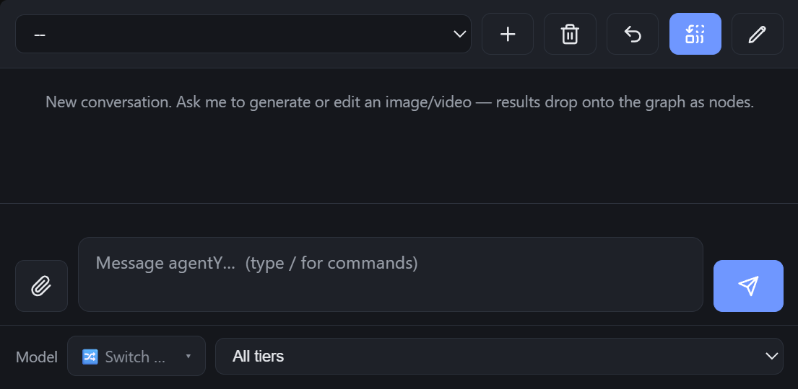
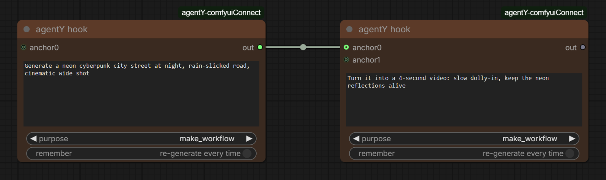
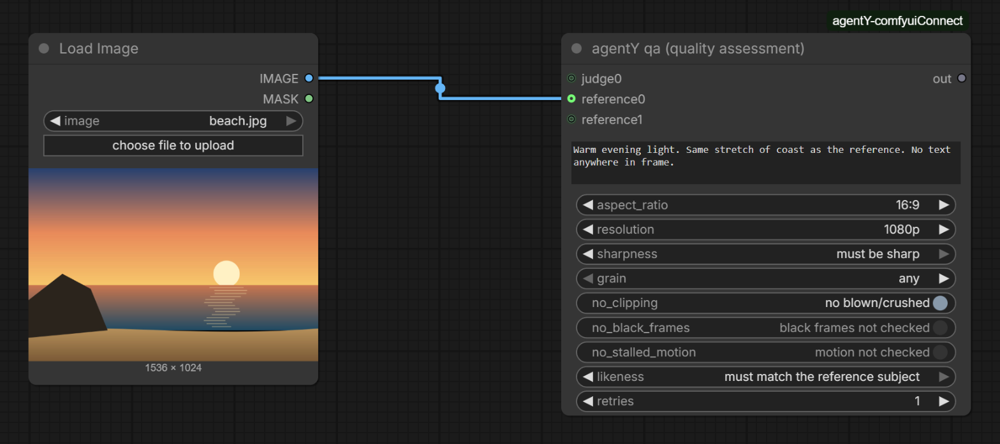
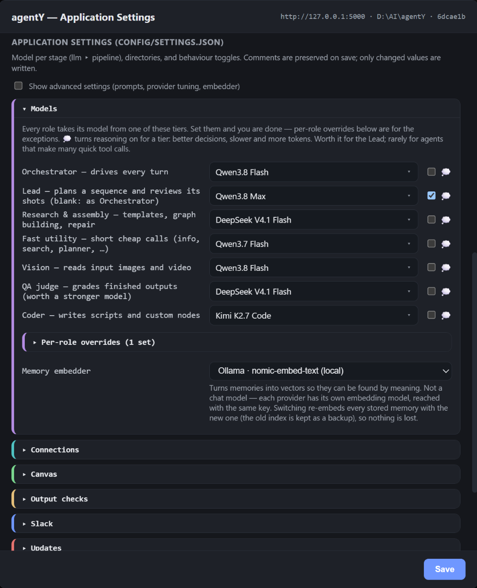
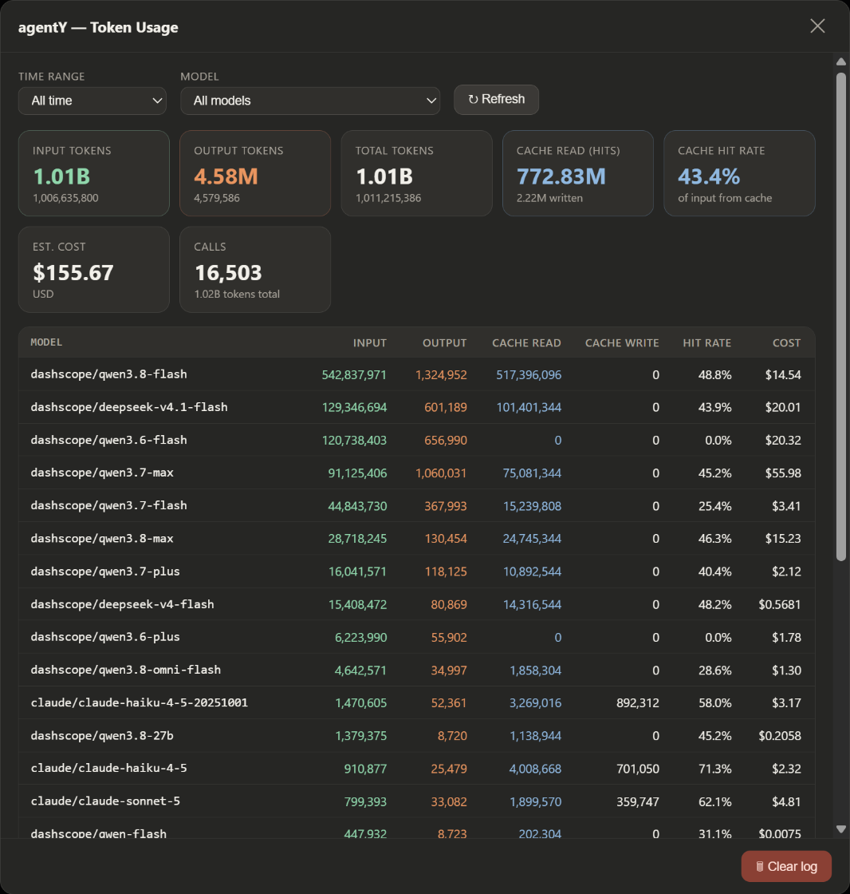

# Using agentY

How to drive **agentY** once it is running. For install and setup see the
[README](../README.md); for ports, security and other internals see the
[reference](reference.md).


## Contents

- [The big picture](#the-big-picture)
- [Starting a session](#starting-a-session) · [Staying up to date](#staying-up-to-date)
- [The chat panel](#the-chat-panel)
- [Generating & editing](#generating--editing)
- [Slash commands](#slash-commands)
- [The hook system](#the-hook-system)
- [Working on your canvas](#working-on-your-canvas)
- [Checking outputs (QA)](#checking-outputs-qa)
- [The agentY python node & collectors](#the-agenty-python-node--collectors)
- [Slack](#slack-a-second-way-in)
- [Settings & secrets](#settings--secrets) · [Choosing models](#choosing-models)
- [MCP servers](#mcp-servers)
- [Token usage & cost](#token-usage--cost)
- [Memory](#memory)
- [Workflow templates](#custom-workflow-templates) · [Model files](#finding-and-fetching-model-files)
- [Building a node for a new model](#building-a-node-for-a-new-model)
- [Troubleshooting](#troubleshooting)

---

## The big picture

You describe what you want. agentY picks a template, builds a ComfyUI workflow,
runs it, checks the result against your [QA briefing](#checking-outputs-qa) if you
set one, and puts the output on your graph as a loader node.

Two ways to drive it:

1. **Chat** — type in the sidebar.
2. **Canvas hooks** — put **`agentY hook`** nodes on the graph and ask the agent to
   run it. See [The hook system](#the-hook-system).

---

## Starting a session

1. Start the agent:

   ```powershell
   .\run_agent.ps1     # Windows
   ```
   ```bash
   ./run_agent.sh      # macOS
   ```

   If it isn't running, the chat panel shows a **▶ Start server** button that
   starts it in a terminal window.
2. Open ComfyUI and click the **agentY** tab in the left sidebar.
3. Type. `/` opens the command menu; the dropdown at the top switches conversations.

Restart the launcher to pick up code or config changes on the agent side.

### On a Mac

The same app, with these differences:

- The scripts are `./install_agent.sh` and `./run_agent.sh`, with `--port`-style
  switches. *Permission denied* → `chmod +x run_agent.sh`.
- The GPU is Metal. The normal PyPI torch already supports it;
  `check_env.py --gpu` says whether it was found.
- The agent listens on port **5001** (AirPlay holds 5000). The panel is told the
  port, so nothing needs matching by hand.
- Install the Xcode Command Line Tools first (`xcode-select --install`).
- Tested on Apple Silicon, macOS 14+.

### Staying up to date

Every start fast-forwards agentY, `agenty_core` and the sidebar extension:

- Local files the update doesn't touch are left alone. Files it does touch are
  parked in a `git stash` first, never discarded.
- Unpushed commits are never rebased or reset; a diverged branch is reported and
  skipped.
- Being offline is not an error.
- If dependencies changed, they are reinstalled before the app starts. If the
  extension changed, you are told to restart ComfyUI.

Turn it off with `auto_update = false`, `-NoUpdate` / `--no-update`, or
`AGENTY_NO_UPDATE=1`. Set `comfyui_dir` if your ComfyUI isn't next to agentY.

---

## The chat panel



| Control | What it does |
|---|---|
| **Thread dropdown** | Switch conversations. 🟢 marks one an agent is working on. |
| **➕ New chat** / **🗑 Delete** | Start or delete a conversation. |
| **↩ Undo** | Undo the agent's last turn. |
| **✍ Prompt loop** | Refine a prompt [round by round](#refining-a-prompt-round-by-round). |
| **🖼 Auto-graph** | Whether finished workflows are loaded onto the canvas automatically. |
| **📎 Attach** | Add an image to your message. |
| **Model picker** | Switch the model for all agents or one role (same as `/switch_model`). |

### Several conversations at once

Send something, press **➕ New chat**, send something else: both run at the same
time, each with its own agent.

- **How many:** five by default (`parallel_chats`, 1–20). Extra ones wait their turn.
- **What runs in parallel:** thinking, research, building, API generations. Renders
  on your own GPU still queue in ComfyUI.
- **Stop** stops only the conversation it is pressed in.
- **The canvas** is shared: the first conversation to change it holds it until its
  turn ends. Others can read it, and build a separate workflow instead of editing.

### A sequence, one conversation per shot

Brief one conversation — the **lead** — and ask it to give each shot its own agent
("work on these six shots in parallel"). It writes the notes all shots share
(characters, look, models, naming) and starts one conversation per shot.

- Shots appear indented under the lead (`↳ sh010`). Open one to watch or steer it.
- A finished shot reports back to the lead, which reviews it and decides what's next.
- **⏹ Stop shots** stops every running shot; Stop inside a shot stops only that one.
- `shots_dry_run`: shots build and validate their workflows but don't render.
- `shots_max_tool_calls` (80): a shot that reaches it is told to wrap up.
- A shot cannot start shots of its own.
- The lead runs on the **Lead** model tier, with reasoning on by default.

### Talking to a running turn

Just type. A message sent while the agent works goes into that turn:

- Between steps, the agent reads it and carries on from there.
- While ComfyUI renders, it is read right away; the render continues unless you
  ask to stop.
- While a model downloads, it is read within a minute.
- A single long step can't be entered part-way; your message lands when it returns.

**Ctrl + Enter** sends it urgently: the agent reads you before its next step.
**⏹ Stop** stops everything, including ComfyUI. Slash commands wait as a **⏳ chip**
and go out when the turn ends.

### Long conversations stay quick

After each turn agentY shrinks the history in the background: old tool output is
cut to its first lines, and if that isn't enough, older turns are summarised. The
last two turns stay word for word. Everything removed is archived in
`memory/history_archive/`.

`/compact` does it on the spot (in Slack: reply `compact`). **Settings ▸
compaction** has the budgets and the off switch.

### Undoing a step

**↩ Undo** (or `/undo`; in Slack reply `undo`) takes the conversation back to
before the agent's last turn: its messages, the agent's memory of it, its images
in the image list, and the canvas — unless you edited the canvas since, in which
case the panel offers **Restore canvas anyway**. The last ten turns can be undone.

Not undone: files on disk, downloaded models, installed node packs, and anything
written to long-term or project memory.

---

## Generating & editing

Describe the outcome:

- *"Generate a cinematic wide shot of Tokyo at night."*
- *"Edit this photo to make it daytime."* (attach with 📎)
- *"Make 5 variations of a red sports car, different angles."*
- *"Upscale the last image with UltimateSD."*

Each result appears as a **loader node on your graph**. The chat carries the text.

**Workflows it doesn't know.** If no template covers a request, the agent builds
the graph from its recipe database. For a model or technique it can't place, it
first searches the web for an example workflow, reads it, and builds from that.

**Nodes that would never run.** ComfyUI skips any node whose output nothing reads,
without an error. Every workflow the agent builds is checked for this and fixed
before it runs. If it had to remove a node instead, it tells you which.

### Refining a prompt round by round

Click your prompt node, then **✍** in the top bar. From then on:

1. You describe the picture → the agent writes the prompt into the node as **v1**
   and queues your graph.
2. You look at the render and say what to change → it looks at the render, writes
   **v2**, and queues again.

Each version is a chip above the message box. Click a chip to put that version
back in the node; the next prompt starts from it.

- **With a QA node on the canvas**, each render is checked as it lands. On a fail,
  the agent writes the next version itself, up to the node's `retries`.
- **Unsupervised:** ask in words — *"keep going until QA is happy, up to 8 tries"*.
  It stops at the first pass, when the tries run out, or when you type. It keeps
  the best version, not the last, and ends with a summary.

The loop belongs to the conversation and survives a reload.

### Finding reference images on the web

> *"Search the web for images of this car — from every angle, and the interior."*

The agent searches, downloads into ComfyUI's `input` folder and drops each picture
it keeps on your graph. Name a number to get that many; otherwise it takes the best
one or two. Watermarked previews and non-images are skipped.

### Marking up an image

> *"Circle the bolts."*  *"Put a red box around the logo."*

The marks are drawn on top of your picture; nothing is re-generated. You choose
shape, colour and labels.

### Asking about a video

Attach a clip and ask about it: frames are sampled and read by the video agent.
Ask for the shots and agentY finds the cuts and writes one file per shot.

### Seeing the plan first

A multi-step job is announced as a short numbered plan, then started. To make the
agent **wait** for your go, say so — in your message, in a hook directive, or in
project memory (*"show me the plan and wait"*). The panel shows **✋ holding** until
you answer.

### Long jobs

*"Run every image in this folder through that workflow"* becomes a **batch job**
that runs in the background. Ask how it is going, or ask it to stop. Stages can
chain (upscale, then grain). Results that finish after the turn (async providers)
arrive on the canvas by themselves, with a notification.

---

## Slash commands

| Command | Action |
|---|---|
| `/restart` · `/stop` | Restart or shut down the agent |
| `/unload` · `/clear_vram` | Unload Ollama models · clear ComfyUI VRAM |
| `/images` | List images generated in this thread |
| `/undo` | Undo the agent's last turn |
| `/compact` | Shrink this conversation's history now |
| `/qa` | Show, set or clear the QA briefing for this thread |
| `/history` · `/memory` · `/project_memory` · `/costs` | Open the log, long-term memory, project memory, cost viewers |
| `/clearhistory` | Delete all conversation history |
| `/switch_model <target> <provider,model>` | Set a tier, a role, or `all` |
| `/add_workflow <path>` · `/add_workflow canvas <name>` · `/remove_workflow <name>` | Register or remove a template |
| `/resend` | Resend the first user message |

---

## The hook system

Hooks are instructions attached to the graph. Add an **`agentY hook`** node
(category **agentY**), wire it, type a directive, and ask the agent to run the
graph (the **agentY hooks** button next to Run). On a normal **Queue Prompt** a
hook does nothing.



- **`anchor`** inputs — context for the hook. A new empty slot appears each time
  you wire one. Any type.
- **`out`** — what the hook produces. Wire it into the input it should fill, or
  into the next hook.
- **`directive`** — the instruction.
- **`purpose`** — what kind of hook it is (below).
- **`remember`** — [keep the result](#the-keep-switch-should-this-outlive-the-run).

Bypass (`Ctrl+B`) or mute a hook to disable it.

### The five purposes

| purpose | what it does | example |
|---|---|---|
| `inline_parameter` (default) | Produces the value(s) for the input its `out` is wired to. Several values run as a batch (max 25). | *"sweep the seed 6×"*, *"every file in this folder"* |
| `make_workflow` | Generates and runs a whole workflow from the directive, using wired anchors as input. | *"upscale 2× and add film grain"* |
| `text` | Writes a string and drops an `agentY text` node carrying it. | *"write a caption for this image"* |
| `general_request` | Free-form: the agent decides what to do. | *"what would improve this workflow?"* |
| `human_review` | Stops the chain so you pick what continues. | see [Review](#review-stop-and-pick-what-continues) |

**Chaining:** wire one hook's `out` into another's `anchor`. Stages run in order,
each feeding its real outputs to the next.

### What the agent sees on an anchor

A wired **Load Image / Load Video** or collector names a file, so the agent sees it
at once. Anything else (a `VAEDecode`, an upscaler, a mask) is a tensor that only
exists during a run, so agentY renders just that branch first
(`🔎 Rendering hook input(s)…`). Your savers don't run. Turn it off with
`hook_tap_tensors`.

### Tagging a reference

The **`agentY add tag`** node sits on a wire (`Load Image → add tag → …`):

- **`tag name`** — a handle such as `hero_face`.
- **prompt box** — what to take from the image: *"the face only, not the hair"*.

Type `#` in any hook's prompt to pick a tag:

```
Put #hero_face in the alley, lit like #alley_light. Wide shot.
```

- Naming a tag in a directive hands the hook that reference; no anchor wire needed.
- **`remember for the project`** stores it in [project memory](#memory), so the tag
  works in other graphs too. Delete it with `/project_memory`.
- Still wire it when the image must reach a node in your own graph, or when it is a
  mid-graph tensor rather than a file.

### Dry run

**agentY hooks ▾ → Dry run** runs the whole turn — every hook answered, every
workflow built and saved under `agent/dryrun_…` — but submits **nothing** to
ComfyUI. Later stages receive stand-in paths, so a whole chain can be checked for
free. QA and review stops are skipped. You get a summary of what would have run.

### Review: stop and pick what continues

A `human_review` hook stops the chain between the stage that makes candidates and
the stage that uses them:

```
make_workflow  →  human_review  →  make_workflow
"one reference                     "animate the
 per character"                     chosen refs"
```

The candidates are gathered into an **`agentY image collector`** next to the hook.
Whatever is in that collector when you continue is what the next stage gets:
delete rows, add your own files, reorder. Then say **continue** (or press
**Continue with these**), or **stop**.

- You can say it instead: *"continue, but drop the second one"*.
- Ask for changes (*"regenerate the third one, warmer"*) and the stop stays up
  while the agent makes them.
- There is no timeout; the stop waits until you answer.
- Candidates are listed best first by a [quality score](#which-of-these-is-best).
- Deleting a row renumbers the references after it (`@image3` becomes `@image2`).
  The agent is told and updates the next stage's prompt.

### The keep switch: should this outlive the run?

`remember` off (default): the hook is worked out again next time. On: its result
is kept.

| purpose | the switch reads | ON keeps |
|---|---|---|
| `make_workflow` | **bake into subgraph** | the generated workflow as a ComfyUI **subgraph** next to the hook, wired to mirror the chain, plus that run's files |
| the others | **memorize result** | what the hook produced (values, prompts, file paths), in `agent/memory/` |

A baked chain is a native workflow you can re-run **without the agent**. Nothing is
removed and the hooks are never rewired.

A memorized hook is skipped on later runs (`♻️ reused …`) until something that
feeds it changes: an upstream node or image, its anchors, its prompt or purpose.
Changes downstream don't release it. To force a fresh result, switch it off, run,
and switch it on again. You can switch it on after a run you liked.

### Naming what a hook produces

Put a role in the directive:

```
Generate one start frame per shot.
role: shot start frame
```

Each output node is titled with the role, gets an `agentY add tag` node, and a
small `.agenty.json` file is written next to the media so the agent knows later
what it is. In a batch, each variant is named after the value that made it.

---

## Working on your canvas

**What the agent sees.** By default only the nodes you have **selected**. Turn on
`canvas_full_graph` to let it read and edit the whole open workflow without a
selection (costs some tokens every turn). It only works on the **active** workflow
tab, and editing never queues the graph.

**Changing a setting by asking.** *"Turn QA off"*, *"stop putting workflows on my
canvas"*. The agent can change a short list of behaviour switches (autograph,
full-graph, QA limits, memory, auto-update, history window). Models, folders, URLs
and keys stay in the Settings dialog.

**Filling an unwired slot.** *"Run those again with the photo I just gave you as a
reference."* The agent adds a loader and wires it into the empty input for that run
only. Your canvas is not changed.

**Screenshots.** *"Send me a screenshot of my workflow."* It is your canvas as you
arranged it, cropped to the graph. Very large graphs come back as an overview
without labels; select a part to get it readable. The ComfyUI tab must be open.


### Loops: keep trying until it's right

> *"Change the prompt until the woman's position matches the original frame."*

The agent runs **your** graph, judges the output against your condition, rewrites
one value and runs again, until the condition is met.

- The condition must be visible in the picture.
- One value changes — by default the positive prompt. Never the checkpoint, sampler
  or seed.
- `Settings ▸ refine ▸ max_runs` (default 4) caps the runs.
- Type anything to stop it after the current run.
- The graph needs a saver that writes to ComfyUI's **output** folder.

It reports every run: what was tried and what the judge objected to.

---

## Checking outputs (QA)

QA only runs when you give it a **briefing**. A briefing is:

- **controls** — measurable requirements: ratio, resolution, sharpness, grain,
  clipping, likeness;
- **criteria** — one checkable statement per line, for what needs judgement;
- **references** — images the output should match.

A separate **QA agent** checks every image and video a run produced and reports
pass / fail / n/a per criterion. Measurable things (dimensions, ratio, duration,
fps, sharpness, grain, exposure) are **computed from the file**, not judged by the
model. Give it a strong vision model (the **QA judge** tier).

### The `agentY qa` node



| input | means | wire in |
|---|---|---|
| **`judge`** | what to assess | a hook's `out`, an IMAGE, a collector, a path. Unwired = everything the run produces |
| **`reference`** | what to compare against | mood boards, grade stills, character sheets |

| control | what it does |
|---|---|
| `aspect_ratio` | compared with the real dimensions (1312x736 counts as 16:9) |
| `resolution` | minimum short side |
| `sharpness` | fails a soft render; shallow depth of field still passes |
| `grain` | fails visible grain |
| `no_clipping` | fails more than 2% pure white or black pixels |
| `no_black_frames` / `no_stalled_motion` | video only |
| `likeness` | see below |
| `retries` | this briefing's retry budget |

`notes` holds the criteria that need judgement. A control left on `any` is not
checked. Several QA nodes on one graph combine.

### Does it match the reference?

`likeness` turns "must match the reference" into a measured score:

- **face** — a face embedding compared with every image wired into `reference`;
- **subject** — a perceptual score for a place, product or grade.

For video the best frame counts. If no comparison is possible (no face found), the
written criterion goes to the QA model instead. The first use downloads about
3.6 GB of models into `models/`; they run on the CPU.

### Which of these is best?

Besides pass/fail there is a **quality score** (0–1) from the same measurements.
It only orders outputs — you see it at a review stop — and never decides anything.

Your review choices are recorded as preferences. After a dozen or so,
`scripts/fit_fitness_weights.py --write` fits the score to your taste, and only
installs the result if it beats the defaults.

### One briefing per stage

Wire a stage into a QA node's `judge` and that node checks only what that stage
produces. Anything from the stage works: the hook's `out`, an IMAGE, its save node.

- An unwired QA node applies to every stage — use it for house rules.
- Where two disagree, the one naming the stage wins.
- A stage no QA node covers is not checked.
- A collector, `LoadImage` or path in `judge` adds those files to what is checked.

### Other ways to write a briefing

- **A named file** — `config/qa/<name>.md`, with images in `<name>.refs/`.
- **`/qa` in chat:**

  ```
  /qa                                      show what's active
  /qa house-style                          use a named briefing
  /qa no text anywhere, warm skin tones    use this as the criteria
  /qa off                                  clear it
  ```

A canvas QA node wins over the thread's `/qa`. Either can cite a file with `@name`.

### It fixes the shape rather than re-rolling

If the briefing says 16:9 and the graph says 1024x1024, agentY sets the size
**before the run**, on the node where the picture is made (never a later resize):

```
📐 Fitted to your briefing — node 1 (EmptyLatentImage): 1024x1024 -> 1920x1080
```

- It works on a copy; your workflow is untouched.
- On a node with a size menu it picks the cheapest option that qualifies.
- A size that is already within tolerance, or a wired input, is left alone.
- If the model can't make that shape, or nothing in the graph sets it, it says so
  and **does not retry**.

### What happens on a failure

Failing outputs are still delivered. With `max_retries = 1` (default) a failing
output is re-generated once, with a new seed and a prompt rewritten for the
criteria it missed. `0` reports and stops.

Say more in the briefing itself:

| you write | what happens |
|---|---|
| `retry: 3` | this briefing's own budget |
| `retry: hook 5` | hook 5 produces new values for the variants that failed |
| `re-run hook 5 x2` | both |

When a run made several outputs, the set is also judged together (one grade,
consistent characters, no near-duplicates).

Other settings under **Settings ▸ qa**: `enabled`, `max_outputs` (how many outputs
are checked), `max_references`, `video_frames`, `briefing_dir`.

---

## The agentY python node & collectors

- **`agentY python`** — runs a Python snippet as a node. Write it yourself or ask
  the agent for one. Inputs arrive as `in0`, `in1`, …; set `outputs = [...]`;
  `save_image(image, "name.png")` writes an image.
  ⚠️ It executes arbitrary Python whenever the graph runs. Don't run workflows
  containing it from untrusted sources. `AGENTY_PYTHON_NODE_DISABLED=1` disables it.
- **`agentY collector`** — a list of files on disk (images and video) handed to the
  agent or the graph. Outputs: `images`, `videos`, `paths`. Type `#` to pick from
  tags and remembered references.
- **`agentY load item`** — loads one entry from [project memory](#memory): an
  image, a clip or a text.
- **`agentY expand image batch`** — splits a batch into `image_1` … `image_8`. Use
  it between a collector and a model node with numbered image slots; wired
  directly, such a slot takes only the first image.

---

## Slack: a second way in

Off by default. Turned on, every turn is mirrored to your Slack DM as it runs, and
a DM back drives the same conversation. You can send images and video as inputs,
and ask the agent to send you files. Setup: [docs/slack.md](slack.md).

---

## Settings & secrets

ComfyUI **Settings → agentY → Open agentY Settings…**



- **Viewers** — message log, long-term memory, project memory, token usage.
- **Authentication (.env)** — API keys. A stored key shows as dots and is never
  sent to the browser; type over it to replace it.
- **Application settings** — Models, Connections, Canvas, Output checks, Slack,
  Updates. **Show advanced settings** adds the rest.
- **Costs & MCP servers** — model prices and [MCP servers](#mcp-servers).

Changed values are saved to `config/settings.local.json`; the defaults in
`config/settings.default.toml` are never edited.

### Choosing models

A model value is `"provider,model"`. Providers: `claude`, `ollama`, `dashscope`
(Qwen), `openai`, `google`. Only providers whose key is set are offered.

You set a few **tiers**; every role inherits from one:

| tier | used for |
|---|---|
| **Orchestrator** | drives every turn |
| **Lead** | the lead of a shot sequence (blank = Orchestrator) |
| **Research & assembly** | finding templates, building and repairing workflows |
| **Fast utility** | lookups, web search, planning, small helpers |
| **Vision** | reading the images and video you provide |
| **QA judge** | grading finished outputs |
| **Coder** | scripts and custom nodes |

- **Per-role overrides** — only when one job needs a different model than its tier.
- **💭 Reasoning** — per tier. Better decisions, slower, more tokens.
- **Order of precedence:** CLI flag → environment variable → role override → tier →
  default.
- A switch (picker, `/switch_model`, or Settings) applies without a restart, after
  the running turn.

```
/switch_model orchestrator claude,claude-opus-4-8
```

---

## MCP servers

agentY can use tools from external **MCP** servers. Manage them under
**Settings ▸ Costs & MCP servers**; they are stored in `config/mcp.json`.

**Adding one:**

1. **+ Add MCP server** and paste the server's address, its start command, or its
   JSON config.
2. **Add.** Keys in what you pasted are moved to `.env`.
3. **Test** — connects once and lists the tools. Add a key or use **Browser
   sign-in** if it asks.
4. **Save.** The server is available after the next agent start.

**Bundles (`.mcpb`):** **Install bundle…**, choose the file, check the command it
will run, fill in its settings, **Install**, **Test**, **Save**. A bundle is code
that runs on your machine — install only ones you trust.

**OAuth servers** (Magnific ships preconfigured): click **Authorize…**, sign in,
restart the agent.

Tools load on demand: the agent knows every server's tool names and loads a
server's tools the first time a conversation needs them. `mcp_tools_on_demand =
false` loads everything up front.

---

## Token usage & cost

**Viewers ▸ Token usage…** (or `/costs`) shows tokens, cache hits and
estimated cost per model, filterable by time and model. Prices come from the
built-in table, overridden by the ones you enter under **Model pricing**.



---

## Memory

- **Conversations** are stored in `memory/conversations.sqlite` and survive a
  restart, including what the agent was working on.
- **Long-term memory** is a local index (`memory/agenty_memory.faiss`) the agent
  reads and writes across sessions.
- **Project memory** holds named references and facts for the current project.

Browse and edit them under **Settings → agentY → Viewers**.

### Choosing the embedder

Long-term memory needs an embedder — a model that turns text into vectors. Choose
it under **Settings ▸ Models ▸ Memory embedder** (the installer asks too).

| choice | model | needs |
|---|---|---|
| **Local** | `nomic-embed-text` v1.5, built in | nothing (downloads ~130 MB on first use) |
| **Ollama** | `nomic-embed-text` | Ollama running |
| **Alibaba DashScope** | `text-embedding-v4` | `DASHSCOPE_API_KEY` |
| **Google Gemini** | `gemini-embedding-001` | `GEMINI_API_KEY` |
| **OpenAI** | `text-embedding-3-small` | `OPENAI_API_KEY` |

Anthropic has no embedding model. Switching re-embeds your stored memories
automatically; the old index is kept in `memory/backup-embedder-<time>/`.

---

## Custom workflow templates

Register your own workflows so the agent can use them:

```powershell
.\scripts\add_workflow.ps1 path\to\your_workflow_api.json
.\scripts\remove_workflow.ps1 your_workflow_api
```

Or in chat: `/add_workflow <path>`, `/add_workflow canvas <name>` (the open graph),
`/remove_workflow <name>`.

ComfyUI's own templates are synced on every start, so a model ComfyUI ships a
template for is one the agent knows. A custom template with the same name wins.
Turn the sync off with `sync_templates_from_comfyui = false`.

## Finding and fetching model files

Ask in plain words: *"do I have the LTX-2.5 text encoder?"*, *"get the models this
workflow needs"*, *"which repos have an fp8 Wan 2.2 VAE?"*. The agent can list
what is installed, read which models a workflow needs, find files on Hugging Face,
and download them into the right ComfyUI folder. A gated repo is named as such,
with the link to accept its terms; set `HF_TOKEN` for those.

## Building a node for a new model

> *"Build me a ComfyUI node for github.com/…"*

For a model that has no ComfyUI node yet (experimental). The coder agent reads the
repo and writes a node pack into `output/custom_nodes/<name>/`.

---

## Troubleshooting

- **"▶ Start server" / can't connect** — the agent isn't running. Start the launcher.
- **"… is not multimodal"** — the Vision or QA judge tier points at a text-only
  model. Pick a vision model in Settings ▸ Models.
- **A setting or button does nothing / 404** — restart the launcher.
- **Canvas nodes look stale after an update** — restart ComfyUI and reload the page.
- **"🚫 … refused this generation on content grounds"** — the provider's filter
  rejected it. agentY retries with a new seed, then shows the provider's message.
- **"No output files found in ComfyUI history"** — your save node must write to
  ComfyUI's output folder.
- **A hook did nothing on Queue Prompt** — by design. Run it with the agentY hooks
  button.
- **Likeness "not measurable"** — it needs a face in both the output and a
  reference image.
- **First QA run with likeness is slow** — it is downloading its models, once.
- **Model switch had no effect** — it waits for the running turn; an environment
  variable (e.g. `ORCHESTRATOR_LLM`) overrides Settings.
